# Laporan Praktikum Basis Data - Pertemuan 01

**Nama:** Danang Setiawan   **NIM:** 25430121   **Kelas:** A   **Tanggal:** 07 Oktober 2026

## 1. Tujuan Praktikum

- Menjalankan dan menghentikan layanan MariaDB melalui XAMPP Control Panel 
serta membaca status dan port-nya.
- Terhubung ke server MariaDB melalui klien baris perintah (CLI) dan 
phpMyAdmin, lalu menjelaskan perbedaan keduanya.
- Mengamankan akun root dengan password dan membuat akun kerja yang hak 
aksesnya terbatas pada satu basis data.
- Membuat basis data pertama dan mencatat pekerjaan ke repositori Git yang 
terhubung ke GitHub.
- Membuktikan lewat perintah verifikasi bahwa lingkungan benar-benar siap, bukan sekadar "merasa sudah terpasang.

## 2. Ringkasan Dasar Teori

Basis data adalah tempat untuk menyimpan data yang saling berhubungan supaya data lebih rapi dan mudah digunakan. MariaDB adalah DBMS yang bekerja dengan sistem client-server, di mana server menerima perintah dari client seperti Command Prompt atau phpMyAdmin. XAMPP memudahkan kita menjalankan MariaDB, Apache, PHP, dan phpMyAdmin dalam satu aplikasi.

Dalam praktikum, kita belajar menggunakan CLI dan phpMyAdmin, tetapi CLI harus dikuasai karena perintahnya bisa disimpan, diulang, dan dimasukkan ke Git. Untuk keamanan, akun root sebaiknya hanya digunakan untuk mengatur database, sedangkan pekerjaan sehari-hari menggunakan akun dengan hak akses seperlunya.

Git digunakan untuk mencatat perubahan pekerjaan melalui commit dan mengirimkannya ke GitHub. Jadi, Git bukan hanya tempat menyimpan file, tetapi juga menjadi catatan proses pengerjaan proyek dari waktu ke waktu.

## 3. Hasil Langkah Percobaan

**D.1 Menjalankan Layanan MariaDB**

Saya membuka XAMPP Control Panel, lalu menekan Start pada bagian MySQL. Setelah berhasil dijalankan, MariaDB aktif dan terlihat indikator berwarna hijau dengan port 3306.

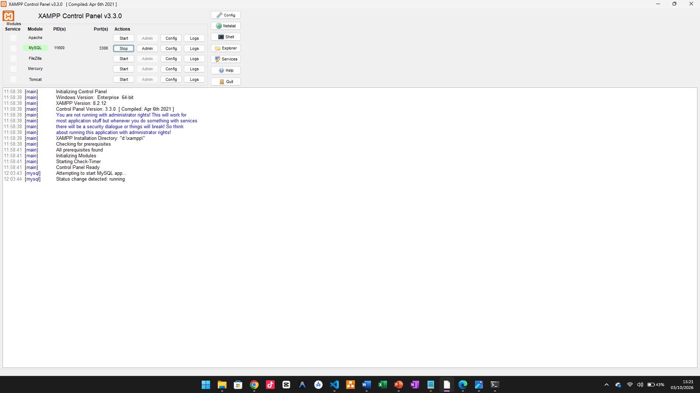

**D.2 Masuk Melalui Klien Baris Perintah**

Saya membuka Command Prompt (CMD) dan masuk ke MariaDB sebagai pengguna root. Setelah muncul prompt MariaDB [(none)]>, saya menjalankan kueri SELECT VERSION(), CURRENT_USER(); untuk melihat versi MariaDB dan akun yang sedang digunakan. Setelah itu, saya menjalankan SHOW DATABASES; untuk melihat daftar database yang dapat diakses oleh akun tersebut.

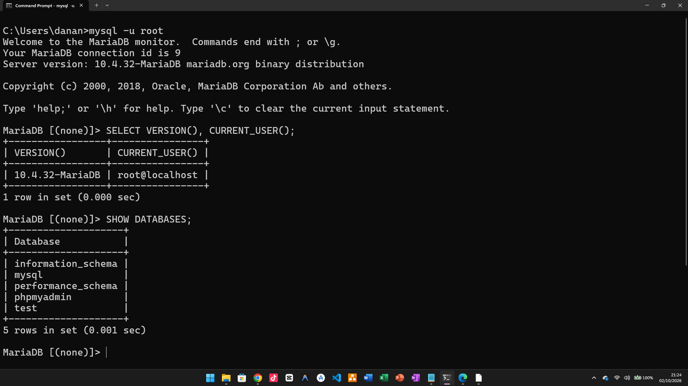

**D.3 Mengamankan Akun root**

Ketiga akun root yang terdaftar di server (localhost, 127.0.0.1, ::1) diberi password yang sama menggunakan ALTER USER, sesuai prinsip bahwa akun MariaDB dikenali sebagai pasangan pengguna@host sehingga masing-masing host harus dikunci terpisah. Tangkapan layar di atas diambil setelah langkah tersebut selesai, memperlihatkan bahwa klien kini diminta memasukkan password sebelum dapat masuk sebagai root.

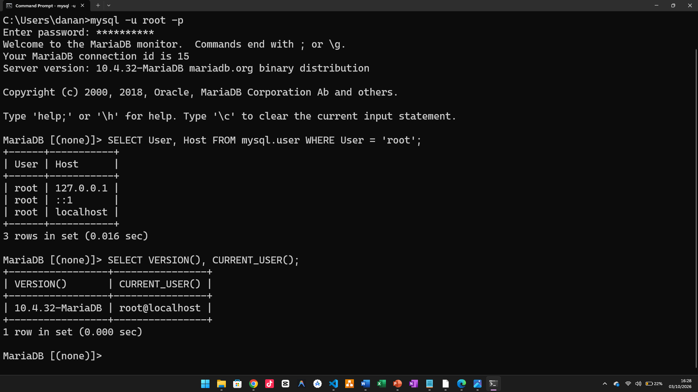

**D.4 Membuat Basis Data dan Akun Kerja**

Saat masih masuk sebagai `root` di CMD, saya membuat basis data `kopma_121` dengan karakter `utf8mb4`. Setelah itu, saya membuat akun kerja `mhs_121` dan memberikan hak akses hanya pada basis data `kopma_121`.

```
CREATE DATABASE kopma_121
 CHARACTER SET utf8mb4 COLLATE utf8mb4_unicode_ci;

CREATE USER 'mhs_121'@'localhost' IDENTIFIED BY 'PasswordKerja';

GRANT ALL PRIVILEGES ON kopma_121.* TO 'mhs_121'@'localhost';

SHOW GRANTS FOR 'mhs_121'@'localhost';
```
Perintah SHOW GRANTS digunakan untuk memastikan bahwa hak akses akun mhs_123 sudah sesuai.
Setelah akun kerja berhasil dibuat, saya keluar dari akun root, kemudian masuk menggunakan akun kerja yang sudah dibuat dengan perintah:
```
mysql -u mhs_123 -p
```
Setelah berhasil masuk, saya menjalankan:
```
SHOW DATABASES;
USE mysql;
```
SHOW DATABASES; digunakan untuk melihat database yang dapat diakses oleh akun mhs_121. Saat menjalankan USE mysql;, muncul ERROR 1044 karena akun mhs_121 tidak memiliki izin untuk mengakses database mysql. Error tersebut memang sesuai dengan pengaturan hak akses yang telah diberikan, yaitu akun kerja hanya diperbolehkan mengakses database kopma_121.

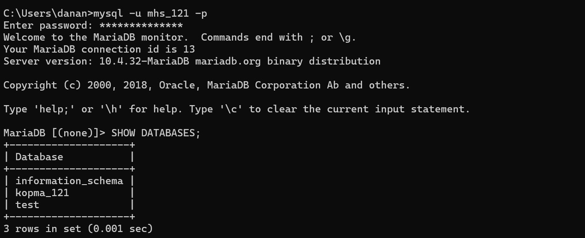
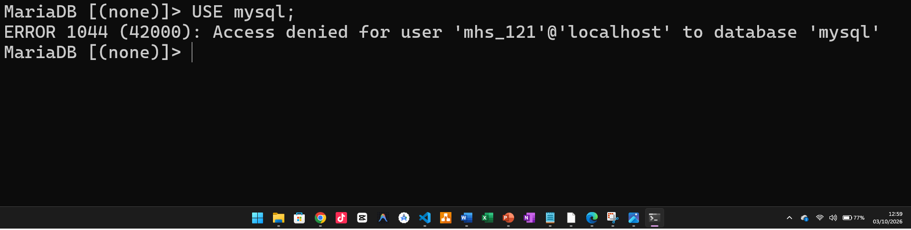

**D.5 Menggunakan phpMyAdmin dengan Aman**

Saya menutup semua jendela peramban terlebih dahulu, kemudian membuka berkas `D:\xampp\phpMyAdmin\config.inc.php` menggunakan editor teks disini saya memakai Notepad.
Selanjutnya, saya mencari baris:
```
$cfg['Servers'][$i]['auth_type'] = 'config';
```
Kemudian saya mengubah nilainya menjadi:
```
$cfg['Servers'][$i]['auth_type'] = 'cookie';
```

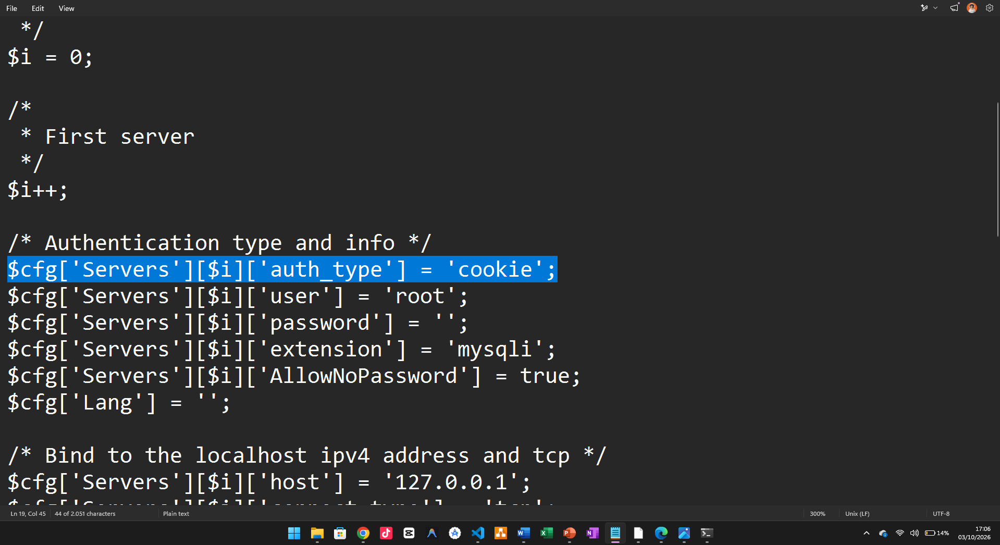

Setelah perubahan disimpan, saya membuka http://localhost/phpmyadmin. Halaman masuk phpMyAdmin kemudian muncul dan saya masuk menggunakan akun kerja mhs_121.

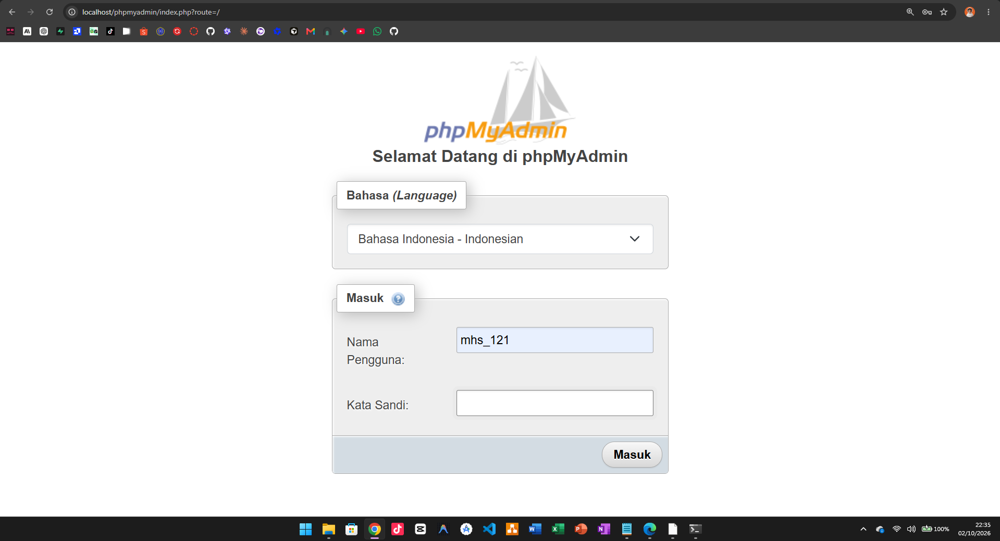

Setelah berhasil masuk, saya membuka tab SQL dan menjalankan kueri yang sama seperti yang sebelumnya dijalankan melalui CLI.

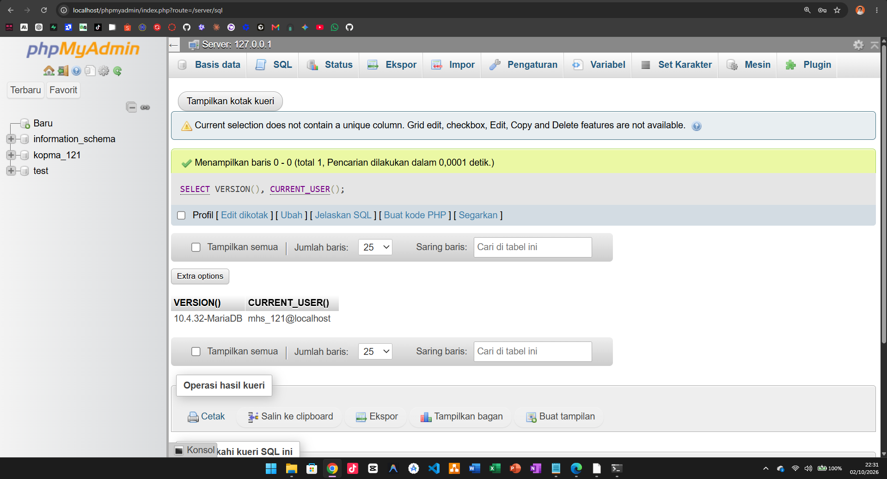
Struktur ini mengikuti langkah D.5 pada buku: mengubah `auth_type` dari `config` menjadi `cookie`, kemudian masuk ke phpMyAdmin sebagai akun kerja dan menjalankan kueri melalui tab SQL. :contentReference[oaicite:0]{index=0}

**D.6 Menyiapkan Repositori Git**

Saya membuat folder kerja proyek, menulis dua berkas wajib, lalu mencatatnya ke Git dan mengirimkannya ke GitHub — git push pertama saya.
Langkah-langkah yang saya lakukan:

**Langkah 1 — Buat folder kerja.**
```
D:\praktikum\basisdata-25430121
```
**Langkah 2 — Buka folder di VS Code.**

**Langkah 3 — Buat berkas README.md di bawah ini adalah isi dari README.md saya:**
```
# Praktikum Basis Data
**Nama:** Danang Setiawan
**NIM:** 25430121
**Kelas:** A
**Mata Kuliah:** Basis Data (Semester 3)
**Lingkungan:** XAMPP 8.2.12 — MariaDB 10.4.32 — phpMyAdmin 5.2.1
```
**Langkah 4 — Buat berkas p01_lingkungan_25430121.sql**
```sql
-- p01_lingkungan_25430121.sql
-- Password sengaja saya ganti penanda. Tidak saya commit password asli.
CREATE DATABASE kopma_121
  CHARACTER SET utf8mb4 COLLATE utf8mb4_unicode_ci;
CREATE USER 'mhs_121'@'localhost' IDENTIFIED BY '<password_kerja>';
GRANT ALL PRIVILEGES ON kopma_121.* TO 'mhs_121'@'localhost';
```
Dibawah ini adalah gambar proses push ke git hub:

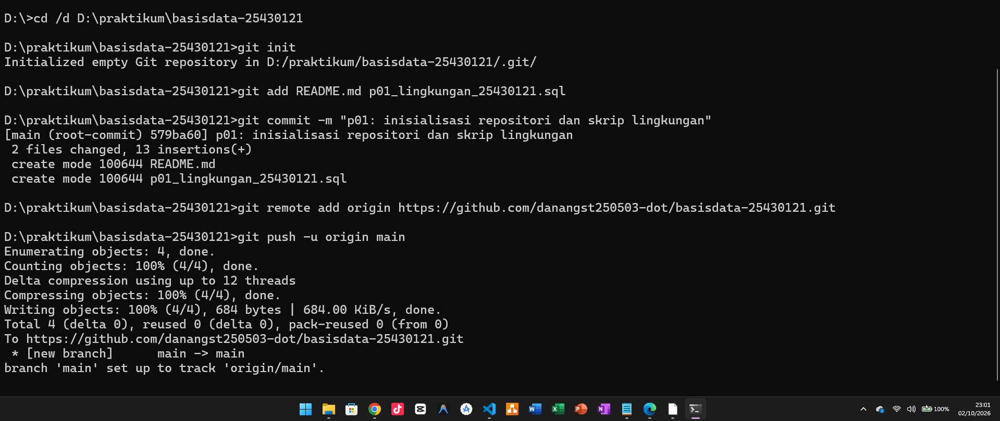
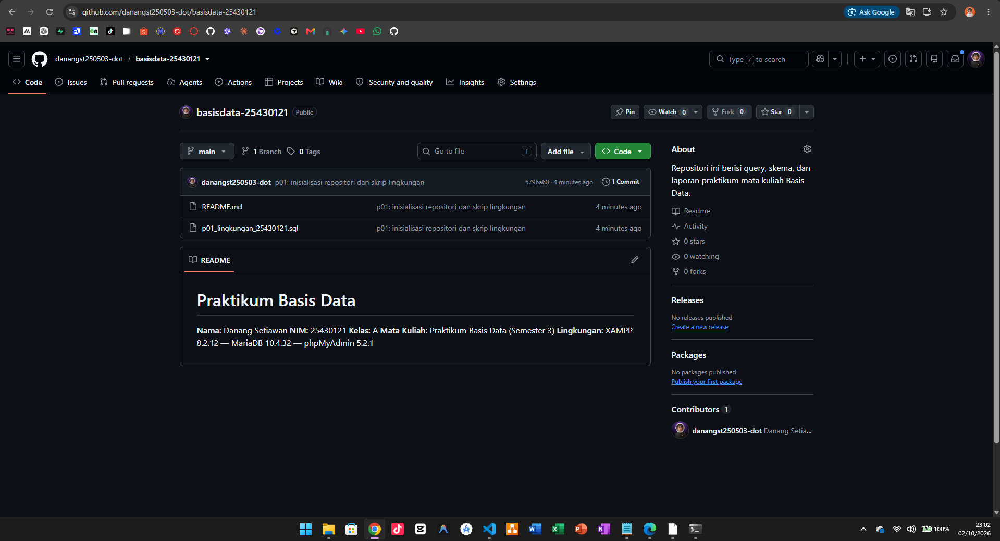

Keterangan fungsi setiap perintah:
| Perintah | Yang dilakukan |
|---|---|
| `git init` | Menjadikan folder ini sebagai repositori Git (membuat folder tersembunyi `.git`). |
| `git add` | Memilih berkas yang akan dicatat pada commit berikutnya. |
| `git commit -m` | Mencatat perubahan secara permanen, dengan pesan sesuai format: `pNN: <deskripsi singkat>`. |
| `git remote add origin` | Memberi tahu Git ke alamat mana harus mengirim; `origin` adalah nama panggilan untuk alamat tersebut. |
| `git push -u origin main` | Mengirim commit ke GitHub; `-u` menetapkan tujuan bawaan agar push berikutnya cukup menggunakan `git push`. |

## 4. Jawaban Titik Analisis
**Titik Analisis 1 — Label "MySQL" tetapi yang berjalan MariaDB**

Karena tombol di XAMPP masih bertuliskan "MySQL", saya harus berhati-hati saat mencari solusi error di internet karena server yang sebenarnya digunakan adalah MariaDB. Kalau langsung mengikuti solusi MySQL tanpa melihat versi dan kondisi MariaDB yang digunakan, ada kemungkinan nilai bawaan atau perilakunya berbeda sehingga solusi tersebut tidak cocok. Dokumentasi MySQL masih bisa digunakan untuk hal-hal yang kompatibel, tetapi kalau menyangkut fitur atau perilaku yang khusus MariaDB, saya harus merujuk ke dokumentasi MariaDB. Hal ini juga saya alami saat memeriksa `sql_mode`, karena hasil di komputer saya tidak langsung sesuai dengan yang disebutkan di buku sehingga saya perlu menyesuaikannya melalui `my.ini`. Karena itu, saat mencari solusi galat saya memakai kata kunci yang menyebutkan produk dan versinya, misalnya `mariadb 10.4 error 1045`, agar hasil pencarian sesuai dengan server yang benar-benar saya pakai.

**Titik Analisis 2 — Membaca pesan ERROR 1045**

Pesan galat yang muncul saat masuk tanpa opsi `-p`:

```
ERROR 1045 (28000): Access denied for user 'root'@'localhost' (using password: NO)
```

*Anatomi pesan:*

| Bagian | Isi |
|---|---|
| Kode | `1045` |
| SQLSTATE | `(28000)` |
| Teks penjelasan | `Access denied for user 'root'@'localhost' (using password: NO)` |

*Bagian yang menentukan.* Frasa `using password: NO` adalah laporan server tentang apa yang dikirim klien, yaitu paket login datang tanpa membawa password sama sekali. Frasa ini menentukan karena membedakan keadaan "tidak membawa kunci" (`NO`) dari "kunci salah" (`YES`), dan tindakan perbaikannya berbeda: untuk `NO` saya menambahkan opsi `-p`, sedangkan untuk `YES` saya memeriksa kembali password termasuk tombol Caps Lock.

*Mengapa pesan ini membuktikan server berjalan normal.* Pesan `ERROR 1045` membuktikan bahwa server MariaDB berjalan normal karena koneksi dari klien sudah berhasil sampai ke server dan server sendiri yang mengirimkan pesan penolakan. Server sudah menerima permintaan login, memeriksa informasi yang dikirim, lalu menyimpulkan bahwa password tidak diberikan (`using password: NO`). Jika server mati atau jalur koneksi bermasalah, klien justru akan menampilkan pesan bahwa server tidak dapat dihubungi, bukan `ERROR 1045`.

*Kaitan dengan konsep pengguna@host.*

1. Server menyebut `@'localhost'` karena MariaDB mengenali akun berdasarkan pasangan `pengguna@host`, bukan hanya nama pengguna, sehingga `root@localhost` adalah identitas akun yang spesifik.
2. Karena koneksi dilakukan melalui `localhost`, MariaDB mencocokkan permintaan login tersebut dengan akun `root@localhost`, bukan otomatis dengan `root@127.0.0.1` atau `root@::1`.
3. Kalau saya hanya menjalankan satu `ALTER USER`, maka akun `root` pada host lain masih bisa tetap menggunakan password kosong seperti bawaan XAMPP. Akibatnya, masih ada celah keamanan karena orang lain bisa mencoba masuk melalui host tersebut tanpa password. Jadi, setiap akun `root` dan host yang tersedia perlu diberi password agar tidak ada akses yang masih terbuka.

**Titik Analisis 4 — Mengapa mode cookie lebih aman daripada mode config**

Mode `cookie` lebih aman karena password tidak disimpan langsung di dalam file konfigurasi. Setiap kali membuka phpMyAdmin, pengguna harus memasukkan password sendiri sehingga orang lain yang membuka alamat phpMyAdmin tidak langsung masuk menggunakan akun yang tersimpan di konfigurasi. Mode `config` juga menggunakan satu akun yang sudah ditentukan di file, sedangkan mode `cookie` memungkinkan saya memilih akun yang memang ingin digunakan, seperti `mhs_121`, sehingga lebih sesuai dengan prinsip **least privilege**. Selain itu, password yang tidak ditulis di file konfigurasi juga mengurangi risiko password ikut tersebar ketika file tersebut tersalin atau tersimpan di tempat lain.

## 5. Hasil Latihan dan Modifikasi
**E.1 Akun tamu_121 dengan Hak Terbatas**

**Langkah 1 — Masuk sebagai root**

Saya masuk ke MariaDB menggunakan akun `root` melalui CMD dengan perintah berikut:
```
mysql -u root -p
```
Setelah menjalankan perintah tersebut, saya memasukkan password root hingga berhasil masuk ke MariaDB.

**Langkah 2 — Membuat akun tamu dengan hak akses SELECT**

Setelah berhasil masuk sebagai root, saya membuat akun tamu_121 dan memberikan password untuk akun tersebut.
```
CREATE USER 'tamu_121'@'localhost' IDENTIFIED BY 'PasswordTamuSaya';
```
Selanjutnya, saya memberikan hak akses SELECT kepada akun tamu_121 hanya untuk basis data kopma_121.
```
GRANT SELECT ON kopma_121.* TO 'tamu_121'@'localhost';
```
Dengan pengaturan tersebut, akun tamu_121 hanya memiliki hak untuk membaca data pada basis data kopma_121.

Setelah itu, saya memeriksa hak akses akun untuk memastikan pemberian privilege sudah sesuai.
```
SHOW GRANTS FOR 'tamu_121'@'localhost';
```
Hasil yang muncul:

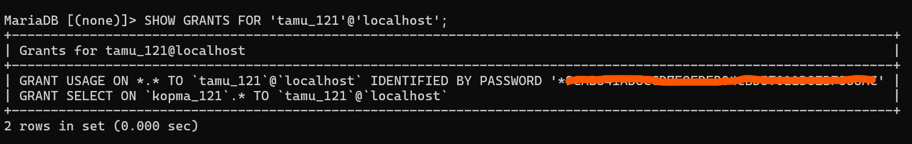

**Langkah 3 — Keluar, masuk sebagai tamu:**

```
exit
```
```
mysql -u tamu_121 -p
```
**Langkah 4 — Pilih basis data, lalu coba membuat tabel:**
```
USE kopma_121;
```
```
CREATE TABLE uji (id INT);
```
Hasil yang muncul:

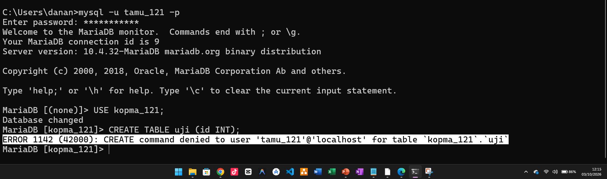

Analisis: Perbedaan 1044, 1045, dan 1142
| Kode | Arti menurut Lampiran |
|---|---|
| `1044` | Akun tidak berhak atas basis data itu |
| `1045` | Password tidak dikirim (`NO`) atau salah (`YES`) |
| `1142` | Akun atau role tidak berhak atas tabel |

**E.2 — Membuat Skrip Dapat Dijalankan Ulang**

**Langkah 1 — Ubah berkas p01_lingkungan_25430121.sql**
```
-- p01_lingkungan_25430121.sql
-- Password sengaja saya ganti penanda. TIDAK saya commit password asli.
CREATE DATABASE IF NOT EXISTS kopma_121
  CHARACTER SET utf8mb4 COLLATE utf8mb4_unicode_ci;
CREATE USER IF NOT EXISTS 'mhs_121'@'localhost' IDENTIFIED BY '<password_kerja>';
GRANT ALL PRIVILEGES ON kopma_121.* TO 'mhs_121'@'localhost';
```
Langkah ini hanya menyisipkan IF NOT EXISTS pada dua baris CREATE. GRANT tidak perlu diubah — memberikan hak yang sudah dimiliki tidak menghasilkan galat.

**Langkah 2 — Uji.**

Disini karena saya sudah berada di folder kerja:
```
D:\praktikum\basisdata-25430121
```
Langsung saya jalankan dua kali perintah ini:
```
mysql -u root -p < p01_lingkungan_25430121.sql
```
Hasil setelah mengetik password, tidak ada keluaran sama sekali — langsung kembali ke prompt D:\praktikum\basisdata-25430121>. Diam = berhasil. Dan hasilnya sama pada kali kedua.

**Langkah 3 — Commit perubahannya.**
```
git add p01_lingkungan_25430121.sql
```
```
git commit -m "p01: skrip lingkungan dapat dijalankan ulang"
```
```
git push
```
Disini saya sesuaikan yang di minta oleh buku modul: "Minimal satu commit bermakna di setiap pertemuan"

## 6. Tugas Mandiri Milestone Proyek
**Langkah 1 — Buat basis data proyek**

Sesuai ketentuan pada modul, tema proyek ditentukan berdasarkan dua digit terakhir NIM. Karena NIM saya adalah `25430121`, dua digit terakhirnya adalah `21`, sehingga saya mendapatkan tema **Perpustakaan** dengan kode tema `perpus`. Tiga digit terakhir NIM saya adalah `121`, jadi nama basis data proyek yang saya gunakan adalah `perpus_121`.

Pertama, saya masuk ke MariaDB sebagai `root` melalui CMD:
```
mysql -u root -p
```
Setelah berhasil masuk, saya membuat basis data proyek dengan perintah berikut:
```
CREATE DATABASE perpus_121
  CHARACTER SET utf8mb4 COLLATE utf8mb4_unicode_ci;
  ```
Perintah CREATE DATABASE saya gunakan untuk membuat basis data baru bernama perpus_121. Saya menggunakan utf8mb4 agar basis data dapat menyimpan berbagai karakter dengan baik, sedangkan utf8mb4_unicode_ci digunakan untuk pengaturan perbandingan dan pengurutan teks.

**Langkah 2 — Membuat Akun `dev_121` dan Menguji Batasannya**

Setelah membuat basis data proyek `perpus_121`, saya membuat akun kerja `dev_121`. Akun ini hanya diberikan hak akses ke basis data `perpus_121`, sehingga tidak bisa mengakses basis data lain.

Pertama, saya membuat akun `dev_121`:

```
CREATE USER 'dev_121'@'localhost' IDENTIFIED BY 'PasswordDevSaya';
```
Kemudian saya memberikan seluruh hak akses pada basis data perpus_121:
```
GRANT ALL PRIVILEGES ON perpus_121.* TO 'dev_121'@'localhost';
```
Setelah itu, saya mengecek hak akses akun tersebut untuk memastikan privilege yang diberikan sudah sesuai:
```
SHOW GRANTS FOR 'dev_121'@'localhost';
```
Setelah selesai, saya keluar dari akun root dan masuk menggunakan akun dev_121:
```
exit
```
```
mysql -u dev_121 -p
```
Setelah berhasil masuk, saya menjalankan:
```
SHOW DATABASES;
```
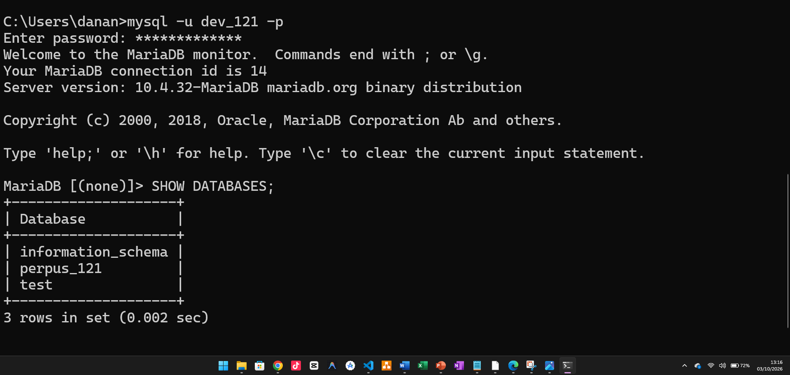

Dari hasil tersebut, perpus_121 terlihat sebagai basis data proyek yang dapat digunakan oleh akun dev_121. Selanjutnya, saya mencoba membuka basis data kopma_121 untuk membuktikan bahwa akun ini memang tidak memiliki akses ke basis data tersebut:
```
USE kopma_121;
```
Perintah tersebut ditolak dan menghasilkan:
```
ERROR 1044 (42000): Access denied for user 'dev_121'@'localhost' to database 'kopma_121'
```
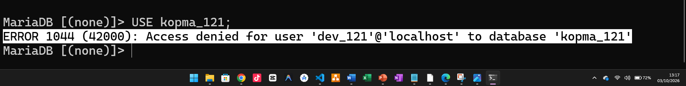

**Langkah 3 — Tambahkan Identitas Proyek ke README**
```
## Identitas Proyek

**Tema:** Perpustakaan
**Kode tema:** perpus
**Basis data proyek:** perpus_121
**Akun proyek:** dev_121
**Nama organisasi:** Perpustakaan Pakde DS

### Lingkup Layanan

Perpustakaan Pakde adalah perpustakaan milik desa yang melayani warga desa setempat, terutama pelajar dan masyarakat umum yang ingin membaca atau meminjam buku. Warga yang ingin meminjam harus mendaftar lebih dahulu sebagai anggota dan menerima nomor anggota yang dipakai pada setiap transaksi. Perpustakaan mengelola katalog koleksi buku yang memuat judul, pengarang, penerbit, tahun terbit, dan jumlah eksemplar yang tersedia. Anggota dapat meminjam paling banyak dua buku sekaligus dengan masa pinjam tujuh hari, dan dapat mengajukan satu kali perpanjangan selama tujuh hari berikutnya. Pengembalian dicatat beserta tanggalnya, dan keterlambatan dikenakan denda sebesar seribu rupiah per hari untuk setiap buku. Seluruh kegiatan pendaftaran anggota, peminjaman, dan pengembalian dicatat oleh petugas perpustakaan yang bertugas, sehingga setiap transaksi diketahui siapa yang menanganinya.
```
Berkas `README.md` berisi identitas proyek, yaitu nama, NIM, kelas, serta informasi dasar proyek basis data yang saya kerjakan.

**Langkah 4 — Buat berkas .gitignore**
```
*.env
kredensial*.txt
```
Saya membuat berkas `.gitignore` di folder kerja untuk mencegah berkas yang berisi kredensial ikut masuk ke repositori Git. Pada berkas ini saya menambahkan pola `*.env` dan `kredensial*.txt` agar berkas dengan pola tersebut diabaikan oleh Git.

**Langkah 5 — Commit dan push**

```
git add README.md .gitignore
```
```
git commit -m "p01: milestone proyek 1"
```
```
git push
```


## 7. Pembahasan dan Kendala

Selama Pertemuan 1 saya menemui tiga kendala. Masing-masing saya tangani dengan
membaca pesan atau hasil yang muncul terlebih dahulu, bukan langsung mengubah langkah.

### 7.1 Mode SQL server tidak ketat

**Gejala.** Pada langkah D.2, perintah `SELECT @@sql_mode;` menghasilkan:

```
NO_ZERO_IN_DATE,NO_ZERO_DATE,NO_ENGINE_SUBSTITUTION
```

Nilai ini tidak memuat `STRICT_TRANS_TABLES`, sedangkan buku mensyaratkan mode ketat
aktif karena dipakai pada Pertemuan 9 dan 15.

**Cara membaca.** Jika mode ketat tidak aktif, MariaDB bisa menerima atau mengubah data yang sebenarnya tidak valid, misalnya tanggal yang salah. Akibatnya, data yang tersimpan bisa menjadi tidak sesuai dengan kondisi sebenarnya dan baru menimbulkan masalah saat digunakan di kemudian hari. Jadi, mode ketat penting untuk menjaga **integritas data**, karena DBMS seharusnya menolak data yang melanggar aturan, bukan membiarkannya masuk begitu saja. :contentReference[oaicite:0]{index=0}

**Tindakan.** Saya mengikuti Troubleshooting Masalah 5: membuka
`D:\xampp\mysql\bin\my.ini`, mencari bagian `[mysqld]`, lalu mengubah baris `sql_mode`
menjadi:

```
sql_mode=STRICT_TRANS_TABLES,ERROR_FOR_DIVISION_BY_ZERO,NO_AUTO_CREATE_USER,NO_ENGINE_SUBSTITUTION
```

Setelah menyimpan berkas, saya melakukan Stop lalu Start pada MySQL di XAMPP Control Panel.

**Verifikasi.** Perintah `SELECT @@sql_mode;` dijalankan ulang dan hasilnya sudah memuat
`STRICT_TRANS_TABLES`.

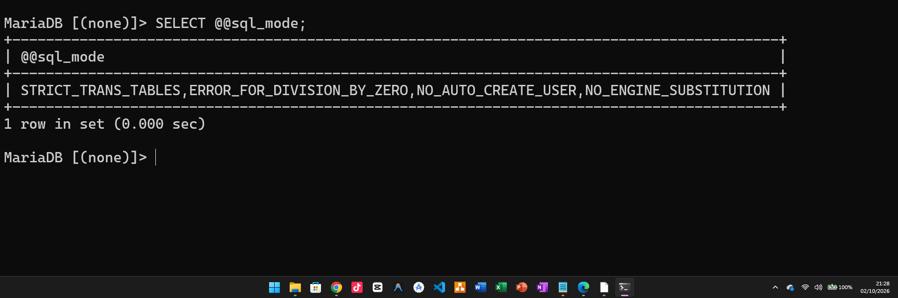

**Pelajaran.** Saya memahami bahwa perubahan pada my.ini tidak langsung memengaruhi server yang sedang berjalan. Server membaca konfigurasi tersebut saat mulai dijalankan, jadi setelah file diubah, MariaDB harus di-restart agar pengaturan baru dibaca dan diterapkan.

### 7.2 phpMyAdmin menolak masuk dengan galat #1045

**Gejala.** Setelah akun root diberi password pada langkah D.3, phpMyAdmin menampilkan
`#1045 Access denied for user 'root'@'localhost' (using password: NO)`.

**Cara membaca.** Pesan ini sama dengan galat yang saya temui di CLI karena keduanya sama-sama merupakan klien yang meminta akses ke server MariaDB. Bedanya, CLI digunakan melalui Command Prompt, sedangkan phpMyAdmin berperan sebagai klien berbasis web yang mengirim permintaan ke server. Frasa using password: NO menunjukkan bahwa phpMyAdmin tidak mengirim password saat mencoba masuk sebagai root, sehingga server menolak proses autentikasinya.

**Tindakan.** Sesuai Troubleshooting Masalah 3 dan langkah D.5, saya mengubah
`$cfg['Servers'][$i]['auth_type']` pada `D:\xampp\phpMyAdmin\config.inc.php`
dari `'config'` menjadi `'cookie'`. Saya tidak menuliskan password root ke dalam
berkas konfigurasi, sesuai larangan di buku.


**Verifikasi.** Halaman `http://localhost/phpmyadmin` menampilkan form login, dan saya
berhasil masuk sebagai `mhs_121`. Kueri `SELECT VERSION(), CURRENT_USER();` pada tab SQL
menghasilkan `mhs_121@localhost`, bukan `root@localhost`.


**Pelajaran.** Menurut saya, galat `#1045` tersebut justru menunjukkan bahwa langkah pengamanan `root` berhasil. Sebelumnya phpMyAdmin mencoba masuk sebagai `root` tanpa password, tetapi setelah `root` diberi password, akses tersebut ditolak oleh MariaDB. Setelah mode `cookie` diubah, saya bisa memasukkan akun dan password sendiri, sehingga saya dapat masuk menggunakan akun kerja `mhs_121`.

### 7.3 Basis data `test` terlihat oleh akun kerja

**Gejala.** Pada langkah D.4, perintah `SHOW DATABASES;` sebagai `mhs_121` menampilkan
tiga baris — `information_schema`, `kopma_121`, dan `test` — sedangkan buku hanya
menyebut dua basis data pada Gambar 1.6.

**Cara membaca.** Perbedaan ini saya periksa dulu sebelum menyimpulkan ada kesalahan.
Hasil `SHOW GRANTS FOR 'mhs_121'@'localhost';` hanya menampilkan
`GRANT ALL PRIVILEGES ON kopma_121.*`, dan perintah `USE mysql;` tetap ditolak dengan
`ERROR 1044`. Dua bukti ini menunjukkan pemberian hak akses yang saya lakukan sudah benar
dan pembatasannya berfungsi.

**Catatan.** Dari modul buku yang saya baca tidak menjelaskan mengapa `test` ikut terlihat oleh akun kerja.
Berdasarkan keterangan di luar buku, basis data `test` dibawa oleh pemasangan MariaDB
beserta hak akses bawaan yang terbuka untuk semua akun, sehingga lolos penyaringan
`SHOW DATABASES`.

**Tindakan.** Tidak ada. Saya tidak menghapus atau mengubah apa pun karena buku tidak
memerintahkannya dan tata tertib laboratorium melarang mengubah konfigurasi di luar
instruksi. Keberadaan `test` tidak memengaruhi langkah mana pun di modul ini.


**Pelajaran.** Saya belajar bahwa hasil praktik tidak selalu harus sama persis dengan contoh di buku, sehingga saya perlu memeriksa penyebab perbedaannya terlebih dahulu. `SHOW GRANTS` membantu saya memastikan hak akses akun yang sebenarnya, jadi saya tidak langsung menyimpulkan bahwa perintah `GRANT` salah hanya karena hasil `SHOW DATABASES` terlihat sedikit berbeda.

## 8. Kesimpulan

Pada Pertemuan 1 saya berhasil menyiapkan lingkungan kerja MariaDB 10.4.32 di XAMPP, mengamankan akun root, membuat akun kerja dengan hak akses terbatas, serta menyiapkan basis data proyek perpus_121 dan repositori GitHub. Saya memahami bahwa akun MariaDB dibedakan berdasarkan pengguna@host, dan penerapan **least privilege** dapat dibuktikan ketika mhs_121 ditolak mengakses database mysql sementara dev_121 juga ditolak mengakses kopma_121. Dari kendala sql_mode yang tidak sesuai dengan ketentuan buku, saya belajar bahwa konfigurasi server harus diperiksa terlebih dahulu karena kondisi awal di komputer saya belum tentu sama dengan yang dicontohkan. Setelah semua langkah dan verifikasi selesai, lingkungan kerja saya sudah siap digunakan untuk melanjutkan ke Modul 2.

## 9. Pernyataan Penggunaan Ai

Saya menggunakan Claude (Anthropic) sebagai pendamping belajar. AI dipakai untuk menjelaskan konsep yang belum saya pahami (arsitektur klien-server, pasangan pengguna@host, prinsip least privilege), membantu saya membaca pesan galat 1044, 1045, dan 1142. Seluruh perintah dijalankan sendiri di komputer saya, seluruh tangkapan layar berasal dari hasil kerja saya, dan jawaban Titik Analisis saya tulis sendiri.

## 10. Bukti Git

**Repositori:**https://github.com/danangst250503-dot/basisdata-25430121
| Hash | Pesan commit |
|---|---|
| 579ba60 | p01: inisialisasi repositori dan skrip lingkungan |
| 5f5b2e5 | p01: skrip lingkungan dapat dijalankan ulang |
| ebc59ae | p01: milestone proyek 1 |
| 789e969 | p01: perbaikan identitas proyek |

## Checklist
|   | Bukti | Yang harus ada |
|---|---|---|
| ✓ | Identitas | Nama, NIM, kelas, pertemuan ke-N, tanggal pelaksanaan, nama asisten/dosen |
| ✓ | Tujuan | Tujuan praktikum ditulis ulang dengan bahasa sendiri (maksimal 5 baris) |
| ✓ | Ringkasan teori | Pemahaman sendiri atas Dasar Teori, maksimal setengah halaman, tanpa menyalin buku |
| ✓ | Langkah percobaan (D) | Tangkapan layar hasil langkah kunci sesuai checklist khusus, masing-masing diberi keterangan singkat |
| ✓ | Titik Analisis | Semua Titik Analisis dijawab lengkap dengan alasan, bukan sekadar ya/tidak |
| ✓ | Latihan (E) | Skrip/dokumen hasil latihan beserta bukti berjalan |
| ✓ | Tugas Mandiri (F) | Milestone proyek pertemuan ini: berkas, bukti, dan penjelasan keputusan desain |
| ✓ | Pembahasan dan kendala | Galat yang ditemui, cara membacanya, dan cara mengatasinya |
| ✓ | Kesimpulan | Dua sampai empat kalimat dengan bahasa sendiri |
| ✓ | Pernyataan Penggunaan AI | Alat yang dipakai, untuk apa, bagian mana; tulis “tidak menggunakan” bila tidak memakai |
| ✓ | Bukti Git | Tautan repositori dan kode commit (hash) pertemuan ini dengan pesan `pNN: ...` |
| ✓ | Keaslian | Setiap tangkapan layar memperlihatkan akun ber-NIM dan jam sistem; nama objek memuat NIM/inisial |