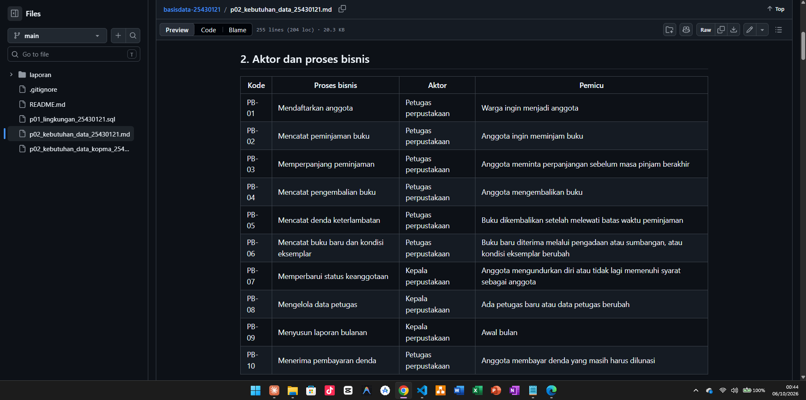
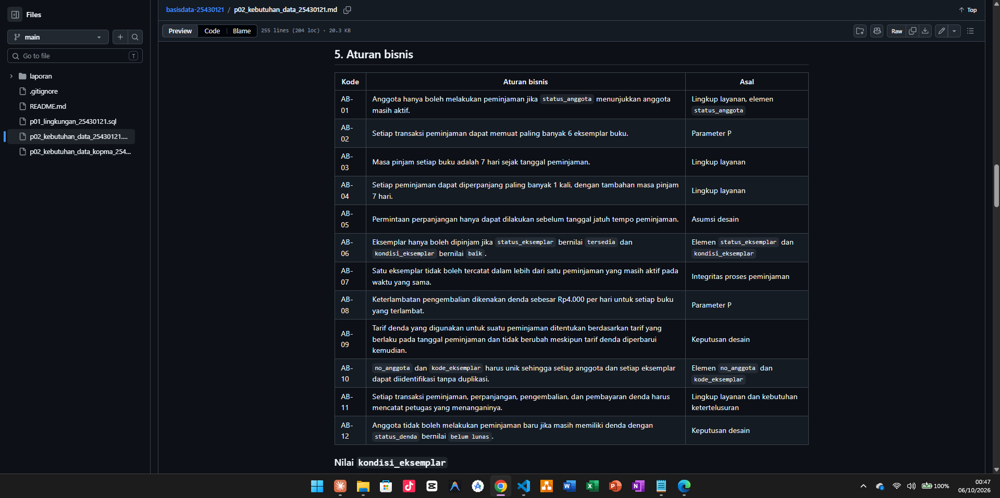
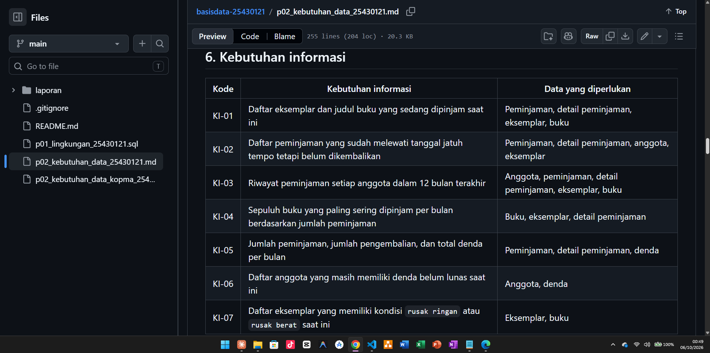
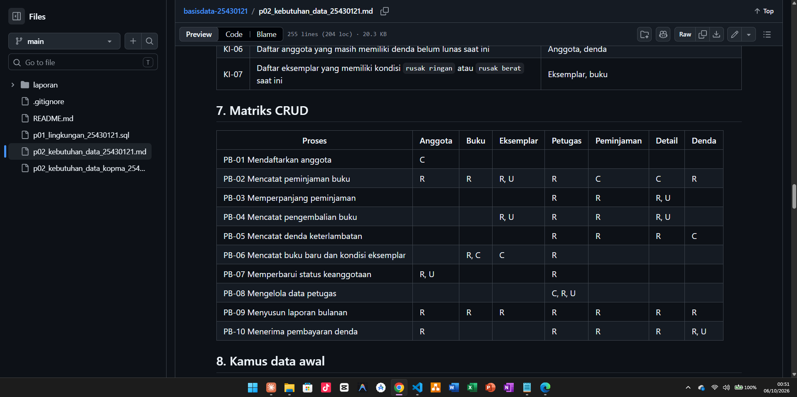
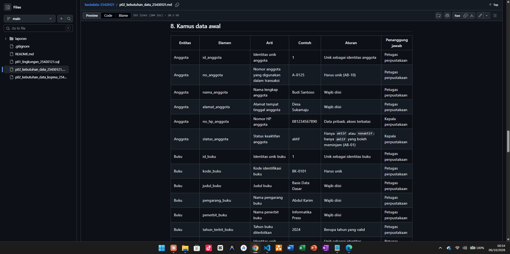
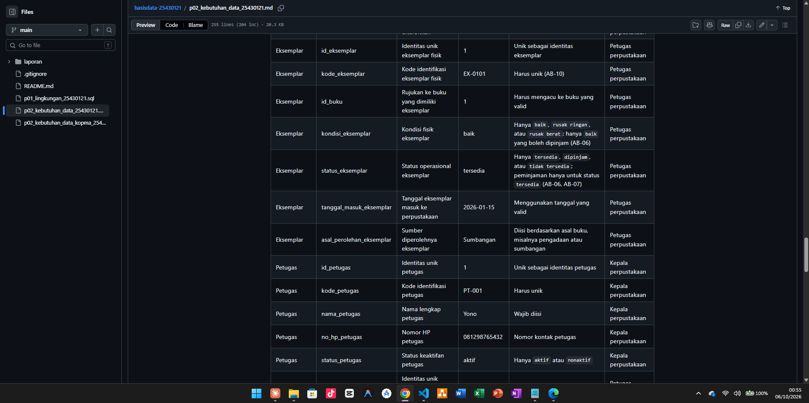
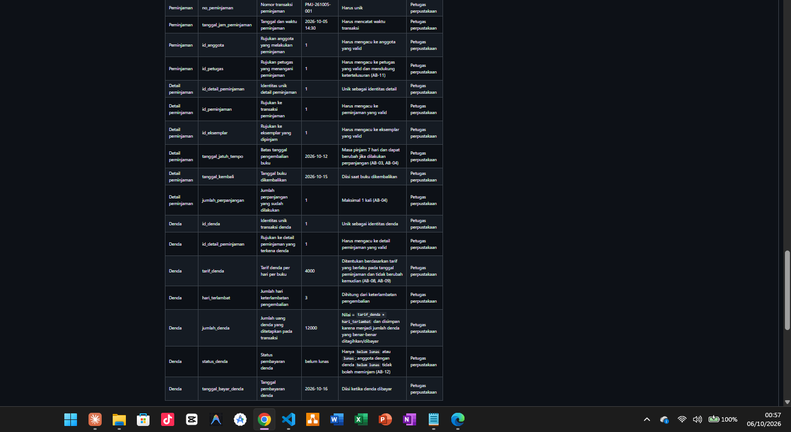

# Laporan Praktikum Basis Data - Pertemuan 02

- **Nama:** Danang Setiawan
- **NIM:** 25430121
- **Kelas:** A
- **Tanggal:** 06 Oktober 2026
- **Dosen:** Dedi Irawan, S.Kom., M.T.I.

## 1. Tujuan Praktikum

Pada Modul 2 saya belajar mengidentifikasi aktivitas, aktor, dan proses bisnis dari berbagai sumber. Saya juga belajar menentukan elemen data, entitas kandidat, dan aturan bisnis dari hasil analisis. Selanjutnya saya menyusun matriks CRUD dan kamus data awal beserta penanggung jawabnya. Hasil analisis tersebut digunakan untuk membuat kebutuhan data dan informasi yang jelas, spesifik, serta dapat diuji.

## 2. Ringkasan Dasar Teori

Analisis kebutuhan perlu dilakukan terlebih dahulu karena kesalahan pada tahap awal dapat menyebabkan data penting tidak tercatat dan sulit diperbaiki setelah transaksi sudah banyak. Contohnya, jika harga harus disimpan pada saat transaksi tetapi baru diketahui belakangan, nilai harga lama sudah tidak dapat dipulihkan.

Matriks CRUD digunakan untuk memeriksa apakah setiap entitas sudah memiliki proses yang membuat datanya. Jika suatu kolom tidak memiliki huruf C, berarti belum terlihat proses yang membuat data tersebut sehingga perlu diperiksa kembali.

Pernyataan kebutuhan yang baik harus menyebutkan data atau kondisi yang jelas, memiliki ukuran atau batas yang dapat diketahui, dan bisa diperiksa hasilnya. Dengan begitu, kebutuhan tersebut tidak hanya terdengar bagus, tetapi juga dapat dibuktikan apakah sudah terpenuhi atau belum.

## 3. Hasil Langkah Percobaan

### D.1-D.2 Membaca studi kasus

Saya membaca narasi studi kasus Kopma, kutipan wawancara, dan dokumen sumber pada Modul 2 untuk memahami aktivitas yang dilakukan serta masalah yang terjadi. Dari tahap ini saya mencatat kegiatan seperti pendaftaran anggota, penjualan, pemeriksaan stok, pemesanan dan penerimaan barang, serta laporan bulanan. Hasil pembacaan ini saya gunakan sebagai dasar untuk mengidentifikasi proses bisnis pada langkah berikutnya.

### D.2 Mengidentifikasi proses bisnis

Saya menandai kata kerja yang menunjukkan kegiatan pada narasi, kemudian mengelompokkannya berdasarkan pelaku dan pemicunya. Dari hasil analisis tersebut saya menyusun proses bisnis Kopma dan menambahkan PB-06 untuk mengelola data pemasok serta PB-07 untuk memperbarui status keanggotaan setelah pemeriksaan matriks CRUD menemukan kolom tanpa huruf `C` (lihat Titik Analisis 3 pada bagian 4). Hasil langkah D.2 terdiri dari 7 proses bisnis, yaitu PB-01 sampai PB-07, yang dicatat lengkap dengan aktor dan pemicu pada berkas `p02_kebutuhan_data_kopma_25430121.md`. PB-08 ditambahkan kemudian sebagai hasil Latihan E.1 dan dibahas pada bagian 5 laporan ini.

### D.3 Membedah dokumen sumber

Saya mengamati nota penjualan Kopma pada Gambar 2.5, kemudian menandai setiap isian sebagai kandidat elemen data dan memilahnya menjadi data yang disimpan atau nilai yang dihitung. Hasilnya terdapat 10 elemen data, dengan 8 elemen disimpan dan 2 elemen dihitung, yaitu subtotal per baris dan total nota; saya juga menemukan bahwa harga satuan saat transaksi perlu disimpan per baris dan menjadi dasar AB-04. Hasil pembedahan dokumen sumber dicatat pada bagian 3 berkas p02_kebutuhan_data_kopma_25430121.md, sedangkan alasan keputusan penyimpanan dan nilai turunan dijelaskan pada Titik Analisis 1 dan 2 di bagian 4 laporan.

### D.4 Entitas kandidat dan aturan bisnis

Saya mengelompokkan elemen data yang menggambarkan hal yang sama menjadi entitas kandidat, kemudian menurunkan aturan bisnis dari narasi dan kutipan wawancara. Hasil langkah D.4 terdiri dari 7 entitas kandidat dan 6 aturan bisnis dengan kode AB-01 sampai AB-06; Penjualan dipisahkan dari Detail penjualan karena satu nota dapat memiliki jumlah baris barang yang berbeda-beda. Hasilnya dicatat pada bagian 4 dan 5 berkas p02_kebutuhan_data_kopma_25430121.md.

### D.5 Kebutuhan informasi dan matriks CRUD

Saya menuliskan laporan yang dibutuhkan oleh ketua koperasi menjadi kebutuhan informasi, kemudian memetakan hubungan setiap proses bisnis dengan entitas menggunakan matriks CRUD yang menunjukkan operasi Create, Read, Update, dan Delete. Hasil langkah D.5 menghasilkan 4 kebutuhan informasi, yaitu KI-01 sampai KI-04, dan matriks CRUD untuk memeriksa hubungan setiap proses dengan data. Dari pemeriksaan matriks ditemukan kolom Pemasok dan Barang yang tidak memiliki huruf C, sehingga saya menambahkan PB-06 untuk mengelola data pemasok, PB-07 untuk memperbarui status keanggotaan, dan PB-09 untuk mengelola data barang; hasil pemeriksaan ini dibahas pada Titik Analisis 3 di bagian 4. Penambahan PB-08 dan entitas Transaksi Poin merupakan hasil Latihan E.1 dan dibahas pada bagian 5 laporan.

### D.6 Kamus data dan kebutuhan non-fungsional

Saya mendokumentasikan 6 elemen data awal yang penting, yaitu no_anggota, nim_anggota, no_hp_anggota, no_nota_penjualan, harga_satuan_detail_penjualan, dan stok_barang, lengkap dengan arti, contoh, aturan, serta penanggung jawabnya. Kolom penanggung jawab digunakan untuk menunjukkan siapa yang berwenang terhadap suatu data sebagai penerapan tata kelola data dari C.2. Penamaan elemen data mengikuti standar Tabel P.3 dengan pola <atribut>_<nama_tabel>, seperti stok_barang dan harga_satuan_detail_penjualan. Selain itu, saya mencatat kebutuhan non-fungsional berupa volume sekitar ±150 nota per hari, retensi data transaksi minimal 5 tahun, dan nomor HP anggota yang hanya boleh dilihat oleh ketua. Hasilnya dicatat pada kamus data dan bagian kebutuhan non-fungsional dalam berkas p02_kebutuhan_data_kopma_25430121.md.

### D.7 Menulis dokumen kebutuhan data

Saya menyalin hasil langkah D.2 sampai D.6 ke dalam berkas dengan mengikuti kerangka 10 bagian yang ditetapkan pada Modul 2. Hasilnya adalah berkas p02_kebutuhan_data_kopma_25430121.md, kemudian saya menyimpan perubahan tersebut melalui commit dengan pesan p02: dokumen kebutuhan data kopma dan hash commit 6eb5ab9.

## 4. Jawaban Titik Analisis

### Titik Analisis 1 Harga saat transaksi

Harga satuan tetap perlu disimpan pada setiap baris transaksi karena harga barang dapat berubah setelah transaksi terjadi. Misalnya, sebuah barang dibeli pada bulan Maret dengan harga Rp10.000, lalu pada bulan April harganya naik menjadi Rp12.000. Jika nota lama hanya mengambil harga terbaru dari tabel barang, transaksi bulan Maret akan terlihat menggunakan harga Rp12.000 sehingga nota dan laporan omzet bulan Maret menjadi salah. Selain itu, harga Rp10.000 yang sebenarnya dibayar sudah tidak tersimpan sehingga kesalahan tersebut tidak dapat diperbaiki atau ditelusuri kembali. Hal ini sesuai dengan keluhan ketua koperasi bahwa harga barang sering naik dan mereka kesulitan saat melihat nota lama.

### Titik Analisis 2 Nilai turunan

**Alasan untuk tidak menyimpan subtotal dan total:**

Subtotal dan total dapat dihitung kembali dari data `qty`, harga, dan diskon, sehingga tidak perlu menyimpan nilai yang sama dua kali. Menyimpan nilai yang dapat dihitung ulang juga dapat menimbulkan perbedaan jika data sumber berubah tetapi nilai turunannya tidak ikut diperbarui.

**Alasan total tetap dapat dipertimbangkan untuk disimpan:**

Total merupakan angka akhir yang tercetak pada nota dan menjadi jumlah yang benar-benar dibayar oleh pembeli, sehingga dapat dianggap sebagai fakta transaksi. Selain itu, aturan perhitungan dapat berubah di kemudian hari. Misalnya, jika diskon anggota yang semula 5% berubah menjadi 7%, menghitung ulang nota lama dengan aturan baru dapat menghasilkan total yang berbeda dari jumlah yang sebenarnya dibayar. Karena itu, keputusan menyimpan nilai turunan perlu mempertimbangkan apakah nilai tersebut hanya hasil perhitungan atau merupakan bagian dari fakta historis transaksi. Keputusan akhir mengenai penyimpanan nilai turunan akan dibahas pada Modul 4.

**Titik Analisis 3 (Bagian A, B, C)**

**Bagian A — Pemasok**

Tidak adanya `C` pada kolom `Pemasok` berarti belum ada proses yang membuat atau mencatat data pemasok. Saya menambahkan **PB-06 Mengelola data pemasok** dengan aktor **petugas gudang**. Proses ini diperlukan karena PB-03 hanya membaca data pemasok untuk membuat pesanan, sehingga tanpa proses untuk membuat data pemasok, data tersebut belum memiliki proses pencatatan yang jelas.

**Bagian B — Status Anggota**

Status aktif anggota juga perlu diperhatikan karena pada proses yang ada belum terdapat proses yang mengubah status tersebut. Saya menambahkan **PB-07 Memperbarui status keanggotaan** dengan aktor **ketua koperasi**, dengan pemicu ketika status keanggotaan anggota berubah, misalnya karena anggota sudah lulus, tidak lagi memenuhi syarat keanggotaan, atau mengundurkan diri. Proses ini diperlukan agar perubahan status anggota dapat dicatat dan data anggota tetap sesuai dengan kondisi sebenarnya.

Tidak adanya C pada kolom Barang berarti belum ada proses yang secara jelas membuat atau mencatat data barang. Saya menambahkan **PB-09 Mengelola data barang** dengan aktor **petugas gudang**, dengan pemicu ketika ada barang baru yang perlu dicatat atau data barang perlu diperbarui. Petugas gudang dipilih karena PB-03 dan PB-04 juga merupakan proses yang menyentuh data Barang, sehingga pengelolaan data barang masih berada pada tanggung jawab petugas gudang. Proses ini diperlukan agar entitas Barang memiliki proses yang membuat dan memperbarui datanya.

### Perhitungan Parameter P

Dua digit terakhir NIM saya adalah 21.

P = (21 mod 9) + 1  
P = 3 + 1  
P = 4

P digunakan untuk menentukan beberapa parameter pada proyek, yaitu:

- Maksimal item dalam satu transaksi = P + 2 = 4 + 2 = **6 item**
- Denda harian = P ribu = **Rp4.000 per hari**
- Perkiraan volume transaksi harian = 40 + 5P = 40 + (5 × 4) = **60 transaksi per hari**

### E.2 — Memperbaiki Tiga Pernyataan Kebutuhan Kabur

**(a) Data anggota harus aman**

Nomor HP anggota (`no_hp_anggota`) hanya boleh dapat dilihat oleh ketua koperasi. Pengujian dilakukan dengan mencoba mengakses data tersebut menggunakan akun ketua koperasi dan akun dengan peran lain. Hasil yang diharapkan adalah hanya ketua koperasi yang dapat melihat data tersebut.

**(b) Sistem harus cepat mencari barang**

Sistem harus dapat menampilkan hasil pencarian barang berdasarkan `kode_barang` atau `nama_barang` dalam waktu maksimal 2 detik pada saat jumlah data barang mencapai 5.000 data. Pengujian dilakukan dengan melakukan pencarian beberapa data dan mengukur waktu sampai hasil pencarian ditampilkan.

**(c) Laporan stok harus akurat**

Jumlah `stok_barang` pada laporan harus sama dengan jumlah barang fisik yang dihitung oleh petugas gudang pada saat pemeriksaan stok akhir bulan, dengan toleransi selisih 0. Pengujian dilakukan dengan membandingkan seluruh data stok pada laporan dengan hasil pemeriksaan fisik.

## 5. Hasil Latihan dan Modifikasi

### E.1 — Poin Loyalitas

Saya menambahkan entitas **Transaksi Poin** dengan 6 elemen data untuk mencatat riwayat perolehan dan penukaran poin. Saya juga menambahkan 5 aturan bisnis, yaitu AB-07 sampai AB-11, 2 kebutuhan informasi yaitu KI-05 dan KI-06, serta proses baru PB-08 **Menukar poin loyalitas** dengan aktor kasir. Matriks CRUD diperbarui dengan menambahkan kolom Transaksi Poin, yang dapat dibuat (C) melalui PB-02 saat anggota memperoleh poin dan melalui PB-08 saat anggota menukar poin.

Saya memutuskan **tidak menyimpan saldo poin sebagai data tersendiri**, tetapi menghitungnya dari riwayat transaksi poin. Keputusan ini dipilih karena riwayat poin perlu ditelusuri berdasarkan tanggal dan periode untuk memenuhi KI-05 dan KI-06, serta untuk menghindari dua sumber data yang dapat memiliki nilai berbeda antara saldo dan riwayat. Karena riwayat hanya dicatat sebagai baris baru, Transaksi Poin tidak memerlukan operasi U. Pada PB-02 dan PB-08, data Anggota hanya dibaca (R) untuk mengetahui anggota yang melakukan transaksi.

Hasil lengkap E.1 diperbarui pada berkas p02_kebutuhan_data_kopma_25430121.md.

### E.2 — Perbaikan Tiga Pernyataan Kebutuhan Kabur

Hasil Latihan E.2 berupa perbaikan tiga pernyataan kebutuhan kabur dicantumkan pada bagian 4 laporan ini sebagai analisis wajib.

## 6. Tugas Mandiri: Milestone Proyek 2

### 6.1 Identitas Proyek

Proyek yang saya kerjakan menggunakan tema **Perpustakaan** dengan kode tema `perpus`, sesuai dua digit terakhir NIM 21. Organisasi yang saya gunakan adalah **Perpustakaan Pakde DS** dengan basis data proyek `perpus_121`. Berkas kebutuhan data proyek yang disusun adalah `p02_kebutuhan_data_25430121.md`.

### 6.2 Pemenuhan Ketentuan Minimum

| Ketentuan | Minimum | Dokumen saya |
|---|---:|---:|
| Proses bisnis | 4 | 10 |
| Entitas kandidat | 6 | 7 |
| Aturan bisnis | 8 | 12 |
| Kebutuhan informasi | 5 | 7 |
| Kamus data | 20 elemen | 42 elemen |
| Matriks CRUD tanpa entitas yatim | Wajib | Terpenuhi |
| Dokumen sumber fiktif | 1 | Slip peminjaman |

Dokumen saya sudah memenuhi ketentuan minimum yang ditetapkan untuk Milestone Proyek 2 dan setiap bagian saling berkaitan antara proses bisnis, data, aturan, kebutuhan informasi, dan kualitas data.

### 6.3 Dokumen Sumber Fiktif

Saya merancang sendiri **slip peminjaman** sebagai dokumen sumber fiktif untuk Perpustakaan Pakde DS. Slip tersebut kemudian saya bedah untuk menentukan elemen data yang disimpan, ditampilkan, atau dihitung. Dari 12 elemen pada slip, terdapat 7 elemen yang disimpan dan 5 elemen yang ditampilkan atau dihitung. Rancangan ini juga membantu menunjukkan alasan pemisahan antara entitas `Peminjaman` dan `Detail peminjaman`, karena satu slip dapat memuat beberapa eksemplar buku sampai maksimal 6 buku.

### 6.4 Bukti Tangkapan Layar

*Gambar 1. Tabel proses bisnis Perpustakaan Pakde DS pada tampilan GitHub.*

*Gambar 2. Tabel aturan bisnis Perpustakaan Pakde DS pada tampilan GitHub.*

*Gambar 3. Tabel kebutuhan informasi Perpustakaan Pakde DS pada tampilan GitHub.*

*Gambar 4. Matriks CRUD proses bisnis terhadap entitas pada tampilan GitHub.*

*Gambar 5. Kamus data Perpustakaan Pakde DS pada tampilan GitHub.*

### 6.5 Penjelasan Keputusan Desain

**Memisahkan Buku dan Eksemplar**

Saya memisahkan `Buku` dan `Eksemplar` karena yang benar-benar dipinjam adalah benda fisik, bukan hanya judul buku. Satu judul dapat memiliki beberapa eksemplar dengan kode, kondisi, dan status yang berbeda. Keputusan ini juga mendukung aturan AB-07 bahwa satu eksemplar tidak boleh tercatat dalam lebih dari satu peminjaman yang masih aktif pada waktu yang sama.

**Memisahkan Peminjaman dan Detail peminjaman**

Saya memisahkan `Peminjaman` dan `Detail peminjaman` karena satu transaksi dapat memuat beberapa buku dengan jumlah baris yang berbeda-beda, sampai maksimal 6 buku. Informasi seperti nomor peminjaman, anggota, petugas, dan waktu transaksi berada pada `Peminjaman`, sedangkan setiap eksemplar yang dipinjam dicatat pada `Detail peminjaman`.

**Menyimpan tarif_denda per transaksi**

Saya memilih menyimpan `tarif_denda` pada transaksi denda agar nilai historis tidak berubah ketika tarif denda diperbarui. Jika tarif saat peminjaman adalah Rp4.000 per hari dan kemudian berubah menjadi Rp5.000, transaksi lama tetap menggunakan tarif Rp4.000 sesuai aturan AB-09.

**Denda sebagai entitas tersendiri**

Saya menjadikan `Denda` sebagai entitas tersendiri karena denda memiliki siklus hidup sendiri, yaitu denda dibuat saat terjadi keterlambatan, dapat berstatus `belum lunas`, kemudian berubah menjadi `lunas` setelah pembayaran dilakukan. Hal ini juga mendukung PB-05, PB-10, dan AB-12.

**Penerapan parameter P**

Parameter P yang diperoleh dari dua digit terakhir NIM adalah 4. Parameter tersebut diterapkan pada proyek menjadi maksimal **6 buku** dalam satu peminjaman, denda **Rp4.000 per hari per buku**, dan volume sekitar **60 transaksi per hari**. Perhitungan lengkap parameter P dicantumkan pada bagian 9 dokumen kebutuhan data proyek.

## 7. Pembahasan dan Kendala

### 7.1 Kolom Pemasok dan Barang Tidak Memiliki Huruf C

**Gejala:** Pada matriks CRUD terdapat kolom Pemasok dan Barang yang tidak memiliki huruf C.

**Cara mengenali:** Saya memeriksa setiap kolom pada matriks dan melihat apakah ada proses yang membuat data pada entitas tersebut.

**Perbaikan:** Saya menambahkan proses pemeliharaan data yang diperlukan, yaitu proses untuk mengelola data pemasok dan proses untuk mengelola data barang. Dengan demikian, entitas tersebut tidak lagi menjadi entitas yang tidak memiliki proses pembentukan data.

### 7.2 Pendaftaran Anggota Sempat Ditulis sebagai Entitas

**Gejala:** Saya sempat menulis Pendaftaran Anggota sebagai nama entitas.

**Cara mengenali:** Saya melihat bahwa istilah tersebut merupakan kegiatan atau tindakan, bukan benda atau kejadian yang datanya dicatat.

**Perbaikan:** Saya mengubahnya menjadi entitas Anggota dan menempatkan Mendaftarkan Anggota pada daftar proses bisnis.

### 7.3 Elemen Transaksi Poin Belum Mengikuti Standar Penamaan

**Gejala:** Beberapa elemen data pada Transaksi Poin sempat belum mengikuti pola penamaan yang digunakan pada tabel standar.

**Cara mengenali:** Saya membandingkan nama elemen pada kamus data dengan aturan penamaan <atribut>_<nama_tabel>.

**Perbaikan:** Saya menyesuaikan kembali nama elemen agar konsisten dengan tabel dan mudah diketahui asal datanya.

### 7.4 Aturan Bisnis Menyebut Saldo Poin tetapi Elemen Datanya Tidak Ada

**Gejala:** Ada aturan bisnis yang menyebut saldo poin, tetapi elemen data yang mendukungnya belum tercantum.

**Cara mengenali:** Saya mencocokkan setiap aturan bisnis dengan elemen data yang diperlukan untuk menjalankannya.

**Perbaikan:** Saya menambahkan elemen yang diperlukan dan memastikan aturan bisnis, kebutuhan informasi, serta kamus data menggunakan istilah yang konsisten.

### 7.5 Kamus Data Terlalu Panjang untuk Satu Tangkapan Layar

**Gejala:** Seluruh kamus data tidak terlihat dengan jelas ketika dimasukkan dalam satu tangkapan layar.

**Cara mengenali:** Saya memeriksa hasil tangkapan layar dan menemukan beberapa baris terlalu kecil atau tidak terbaca.

**Perbaikan:** Saya membagi bukti tangkapan layar menjadi beberapa bagian dan mengatur tampilan agar seluruh isi tetap terbaca dengan jelas.

## 8. Kesimpulan

Setelah mengerjakan Modul 2, saya sedikit memahami bahwa perancangan basis data harus dimulai dari kebutuhan data yang benar, bukan langsung membuat tabel. Saya juga sedikit mampu menggunakan CRUD untuk menemukan proses yang masih kurang dan memperbaiki kebutuhan yang belum jelas. Kesalahan kecil pada proses, penamaan, dan hubungan antarbagian ternyata dapat memengaruhi keseluruhan rancangan data.

## 9. Pernyataan Penggunaan AI

Dalam penyusunan laporan dan dokumen kebutuhan data ini, saya menggunakan Claude (Anthropic) untuk membantu memahami konsep Modul 2, memeriksa kelengkapan analisis, menemukan kesalahan atau inkonsistensi antarbagian, dan membantu merapikan kalimat laporan. Beberapa bagian awal juga saya jadikan bahan yang kemudian saya periksa dan perbaiki kembali agar sesuai dengan hasil analisis saya sendiri.

Keputusan desain tetap saya tentukan sendiri, terutama pemisahan entitas `Buku` dan `Eksemplar`, keputusan menyimpan `tarif_denda` pada transaksi, penambahan PB-10 dan AB-12, serta penetapan nilai `kondisi_eksemplar`. Saya juga memeriksa kembali hasil bantuan AI sebelum memasukkannya ke laporan dan melakukan perubahan pada bagian yang belum sesuai dengan kebutuhan proyek.

## 10. Bukti Git

Repositori: https://github.com/danangst250503-dot/basisdata-25430121

| Hash | Pesan commit |
|---|---|
| 6eb5ab9 | p02: dokumen kebutuhan data kopma |
| b67479d | p02: latihan E1 poin loyalitas dan E2 perbaikan pernyataan |
| 6f7cd1e | p02: penyesuaian parameter P pada identitas proyek |
| 1cc61f8 | p02: latar belakang dan proses bisnis proyek |
| e396037 | p02: perbaikan identitas dan nama organisasi |
| d5b25e2 | p02: perbaikan identitas dan nama organisasi |
| d67cd78 | p02: perbaikan format identitas pada README |
| 22c69df | p02: entitas kandidat dan elemen data proyek |
| c1a9b67 | p02: aturan bisnis proyek |
| ea4aac4 | p02: kebutuhan informasi proyek |
| 14c05c1 | p02: matriks crud proyek |
| a773de6 | p02: kamus data proyek |
| 3a8c608 | p02: milestone proyek 2 dokumen kebutuhan data |
| [isi nanti] | p02: laporan praktikum pertemuan 2 |

## Checklist

### Checklist Umum (Tabel P.13)

| | Butir | Yang harus ada |
|---|---|---|
| ✓ | Identitas | Nama, NIM, kelas, pertemuan ke-2, tanggal pelaksanaan, nama asisten/dosen |
| ✓ | Tujuan | Tujuan praktikum ditulis ulang dengan bahasa sendiri (maksimal 5 baris) |
| ✓ | Ringkasan teori | Pemahaman sendiri atas Dasar Teori, maksimal setengah halaman, tanpa menyalin buku |
| ✓ | Langkah percobaan (D) | Hasil langkah D.1 sampai D.7 beserta keterangannya |
| ✓ | Titik Analisis | Titik Analisis 1-3 dijawab lengkap dengan alasan |
| ✓ | Latihan (E) | Hasil Latihan E.1 dan E.2 beserta bukti perubahannya |
| ✓ | Tugas Mandiri (F) | Milestone Proyek 2: berkas, bukti, dan penjelasan keputusan desain |
| ✓ | Pembahasan dan kendala | Kendala yang ditemui, cara mengenalinya, dan cara mengatasinya |
| ✓ | Kesimpulan | Dua sampai empat kalimat dengan bahasa sendiri |
| ✓ | Pernyataan Penggunaan AI | Alat yang dipakai, untuk apa, bagian mana; tulis "tidak menggunakan" bila tidak memakai |
| ✓ | Bukti Git | Tautan repositori dan kode commit (hash) dengan pesan `p02: ...` |
| ✓ | Keaslian | Setiap tangkapan layar memperlihatkan jam sistem; nama objek memuat NIM/inisial |

### Checklist Khusus Pertemuan 2 (Tabel 2.9)

| | Jenis | Yang harus ada |
|---|---|---|
| ✓ | Berkas wajib | `p02_kebutuhan_data_kopma_25430121.md` |
| ✓ | Berkas wajib | `p02_kebutuhan_data_25430121.md` (proyek) |
| ✓ | Bukti tangkapan layar | Tabel PB pada berkas proyek (tampilan GitHub) |
| ✓ | Bukti tangkapan layar | Tabel AB pada berkas proyek (tampilan GitHub) |
| ✓ | Bukti tangkapan layar | Tabel KI pada berkas proyek (tampilan GitHub) |
| ✓ | Bukti tangkapan layar | Matriks CRUD pada berkas proyek (tampilan GitHub) |
| ✓ | Bukti tangkapan layar | Kamus data pada berkas proyek (tampilan GitHub) |
| ✓ | Analisis wajib | Titik Analisis 1 |
| ✓ | Analisis wajib | Titik Analisis 2 |
| ✓ | Analisis wajib | Titik Analisis 3 (Bagian A, B, dan C) |
| ✓ | Analisis wajib | Perhitungan parameter P |
| ✓ | Analisis wajib | Perbaikan tiga pernyataan kebutuhan kabur |

### Ketentuan Minimum Milestone Proyek 2

| | Ketentuan | Target | Terpenuhi |
|---|---|---|---|
| ✓ | Proses bisnis | minimal 4 | 10 |
| ✓ | Entitas kandidat | minimal 6 | 7 |
| ✓ | Aturan bisnis | minimal 8 | 12 |
| ✓ | Kebutuhan informasi | minimal 5 | 7 |
| ✓ | Matriks CRUD tanpa entitas yatim | wajib | terpenuhi |
| ✓ | Kamus data dengan penanggung jawab | minimal 20 elemen | 42 elemen |
| ✓ | Kebutuhan non-fungsional + identifikasi data pribadi | wajib | terpenuhi |
| ✓ | Dokumen sumber fiktif + pembedahan | minimal 1 | slip peminjaman |