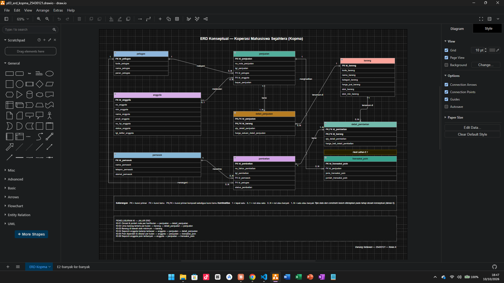
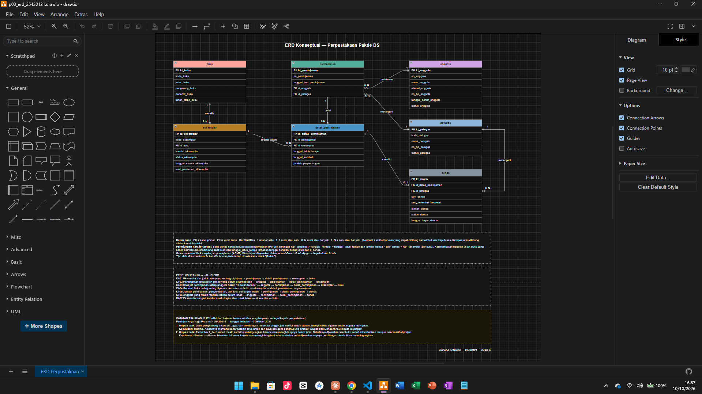

# Laporan Praktikum Basis Data - Pertemuan 03

- **Nama:** Danang Setiawan
- **NIM:** 25430121
- **Kelas:** A
- **Tanggal:** 09 Oktober 2026
- **Dosen:** Dedi Irawan, S.Kom., M.T.I.

## 1. Tujuan Praktikum

Tujuan saya di pertemuan ini adalah mengubah dokumen kebutuhan data dari Modul 2 menjadi sebuah ERD. Dari kamus data saya menentukan dulu entitas, atribut, dan kunci tiap tabel. Setelah itu saya menentukan hubungan antar entitas beserta kardinalitasnya, dan tiap kardinalitas saya dasarkan ke aturan bisnis, bukan sekadar menebak. Saya juga belajar memecah hubungan banyak-ke-banyak menjadi entitas asosiatif. Terakhir, saya menggambar ERD dengan notasi Crow's Foot lalu mengeceknya apakah sudah bisa menjawab semua kebutuhan informasi (KI).

## 2. Ringkasan Dasar Teori

Dari yang saya pelajari, ERD itu cara menggambarkan data dalam bentuk diagram, bukan langsung membuat tabel. Isinya ada tiga hal utama: entitas (benda atau kejadian yang datanya disimpan, misalnya anggota atau penjualan), atribut (sifat atau kolom dari entitas), dan relasi (hubungan antar entitas yang biasanya dibaca sebagai kata kerja). Setiap entitas punya atribut kunci untuk membedakan satu baris dengan baris lain. Ada juga atribut turunan, yaitu nilai yang sebenarnya bisa dihitung dari atribut lain, seperti total nota. ERD ini masih tahap desain konseptual, jadi saya belum menentukan tipe data atau DBMS-nya, yang penting dulu semua kebutuhan datanya terbawa.

Untuk hubungan antar entitas, saya memakai notasi Crow's Foot. Di notasi ini ada dua hal yang dibaca, yaitu kardinalitas (paling banyak berapa) dan partisipasi (wajib ada atau boleh tidak ada). Cara bacanya, simbol yang dekat ke kotak entitas menunjukkan jumlah maksimum, sedangkan simbol yang lebih jauh menunjukkan minimum. Yang saya catat penting, kardinalitas tidak boleh ditebak. Tiap ujung garis harus bisa saya telusuri ke aturan bisnis, misalnya karena ada aturan penjualan boleh tanpa anggota (AB-02), maka sisi anggota menjadi nol atau satu.

Untuk hubungan banyak-ke-banyak, misalnya satu nota berisi banyak barang dan satu barang muncul di banyak nota, hubungan seperti ini tidak bisa langsung disimpan dalam tabel. Jadi harus dipecah dulu menjadi entitas asosiatif, seperti detail_penjualan, apalagi kalau hubungannya punya atribut sendiri seperti qty dan harga saat transaksi.

## 3. Hasil Langkah Percobaan

### D.1 Dari entitas kandidat ke entitas

Saya mulai dari tabel entitas kandidat Kopma yang sudah dibuat di Pertemuan 2, lalu mengubahnya menjadi entitas untuk ERD. Untuk setiap entitas, saya menentukan atribut kuncinya. Saya memakai kunci pengganti id_* sebagai kunci primer, misalnya id_anggota dan id_barang, sedangkan kode alami seperti no_anggota, nim_anggota, kode_barang, dan no_nota_penjualan saya jadikan kunci alternatif yang bersifat unik. Alasan kenapa saya memilih id_* dan bukan NIM sebagai kunci primer saya jelaskan di Titik Analisis 1.

Saya juga menandai atribut turunan, yaitu subtotal per baris dan total nota. Nilai ini tidak saya simpan sebagai kolom karena masih bisa dihitung dari qty dan harga satuan, jadi di ERD tidak saya gambar.

Setelah itu, entitas kandidat "Pembelian dan detailnya" dari Pertemuan 2 saya pecah menjadi dua entitas, yaitu pembelian dan detail_pembelian, mengikuti pola yang sama seperti penjualan dan detail_penjualan. Dari langkah ini saya mendapat delapan entitas: petugas, anggota, barang, pemasok, penjualan, detail_penjualan, pembelian, dan detail_pembelian.

### D.2 Menentukan relasi dan kardinalitas

Untuk setiap pasangan entitas yang berhubungan, saya menulis kalimat relasi dengan kata kerja, lalu menjawab "minimal berapa?" dan "maksimal berapa?" dari kedua arah. Setiap kardinalitas ditelusuri ke aturan bisnis yang mendasarinya.

| Relasi | Sisi kiri | Sisi kanan | Dasar |
|---|---|---|---|
| petugas melayani penjualan | tepat satu petugas | nol atau banyak penjualan | wawancara kasir |
| anggota melakukan penjualan | nol atau satu anggota | nol atau banyak penjualan | AB-02 |
| penjualan berisi detail_penjualan | tepat satu penjualan | satu atau banyak detail | AB-01 |
| barang tercantum di detail_penjualan | tepat satu barang | nol atau banyak detail | AB-04 |
| pemasok menerima pembelian | tepat satu pemasok | nol atau banyak pembelian | AB-06 |
| pembelian berisi detail_pembelian | tepat satu pembelian | satu atau banyak detail | faktur pemasok |
| barang tercantum di detail_pembelian | tepat satu barang | nol atau banyak detail | faktur pemasok |
| petugas menangani pembelian | tepat satu petugas | nol atau banyak pembelian | AB-12 |

**Catatan tambahan di luar Tabel 3.2 buku:**

Dua baris terakhir tidak tercantum pada Tabel 3.2 buku. Relasi `barang tercantum di detail_pembelian` saya tambahkan karena relasi tersebut tampak pada Gambar 3.2 dan diperlukan agar entitas `detail_pembelian` memiliki rujukan ke barang yang dibeli. Relasi `petugas menangani pembelian` merupakan hasil Titik Analisis 3 dan didasarkan pada AB-12 yang saya tambahkan.

### D.3 Menggambar ERD

Saya menggambar ERD di draw.io memakai bentuk Entity Relation. Kedelapan entitas saya gambar lengkap dengan semua atributnya dari kamus data, bukan cuma kuncinya. Kolom kunci primer saya beri label PK dan kunci tamu saya beri label FK, sedangkan kunci primer komposit pada tabel detail (detail_penjualan dan detail_pembelian) saya tandai PK,FK. Garis relasi saya tarik dari kunci primer ke kunci tamu yang mengacu kepadanya, dan tiap ujung garis saya beri simbol Crow's Foot sekaligus label angkanya (1, 0..1, 0..N, 1..N).

Biar rapi dan sesuai standar kelengkapan ERD konseptual pada Tabel 3.3, tiap entitas saya beri satu warna berbeda, saya tambahkan kotak legenda di bawah diagram, lalu judul dan tanda tangan (nama dan NIM). Pada tahap ini saya belum menuliskan tipe data maupun constraint, karena bagian itu baru dikerjakan di Modul 5.

Hasilnya saya simpan dalam dua berkas, yaitu p03_erd_kopma_25430121.drawio sebagai berkas sumber dan p03_erd_kopma_25430121.png sebagai gambarnya.

*Gambar D.3 ERD konseptual Kopma dengan notasi Crow's Foot.*

### D.4 Memvalidasi ERD terhadap kebutuhan informasi

Saya menelusuri jalur hubungan pada ERD untuk memastikan setiap kebutuhan informasi dapat dijawab oleh entitas yang tersedia. Pemeriksaan awal menunjukkan bahwa KI-05 dan KI-06 belum dapat ditelusuri karena ERD belum memiliki entitas riwayat poin. Setelah mengerjakan Latihan E.1, saya menambahkan transaksi_poin beserta relasinya, lalu memperbarui jalur kedua kebutuhan informasi tersebut.

| Kode | Kebutuhan informasi | Jalur di ERD |
|---|---|---|
| KI-01 | Omzet dan jumlah nota per hari dan per bulan | penjualan → detail_penjualan |
| KI-02 | Lima barang terlaris per bulan berdasarkan qty | barang → detail_penjualan → penjualan |
| KI-03 | Barang dengan stok di bawah batas minimum | barang |
| KI-04 | Sepuluh anggota dengan belanja terbesar per bulan | anggota → penjualan → detail_penjualan |
| KI-05 | Jumlah poin yang diperoleh dan ditukar anggota per bulan | anggota → penjualan → transaksi_poin |
| KI-06 | Sepuluh anggota dengan perolehan poin terbanyak per bulan | anggota → penjualan → transaksi_poin |

## 4. Jawaban Titik Analisis

### Titik Analisis 1 — Kunci primer dan kunci alternatif

Saya memilih `id_anggota` sebagai kunci primer karena merupakan identitas internal yang tetap dan tidak bergantung pada data bisnis anggota. `no_anggota` dan `nim_anggota` tetap disimpan sebagai kunci alternatif dengan constraint `UNIQUE`, sehingga pencarian anggota melalui nomor anggota atau NIM tetap dapat dilakukan tanpa menjadikan data tersebut sebagai kunci primer.

Jika NIM dijadikan kunci primer, salah satu risikonya adalah ketika NIM berubah, perubahan tersebut dapat merambat ke kunci tamu pada tabel lain yang mengacu ke anggota sehingga berisiko menimbulkan inkonsistensi data.

### Titik Analisis 2 — Kardinalitas minimal satu detail

**Bagian A**

Relasi `Penjualan` terhadap `Detail penjualan` pada kasus Kopma bernilai `1..N` karena **AB-01** menyatakan bahwa setiap nota memiliki nomor unik dan minimal satu baris barang. Artinya, sebuah nota tanpa barang tidak dianggap sebagai transaksi penjualan yang lengkap. AB-02 hanya mengatur batas lain, yaitu penjualan untuk anggota aktif dan diskon 5%, sehingga tidak menjadi dasar untuk nilai minimum detail.

**Bagian B**

Aturan minimal satu detail tidak dapat dijaga hanya dengan struktur tabel. Foreign key pada `Detail penjualan` hanya memastikan bahwa detail mengacu pada `Penjualan` yang valid, tetapi tidak memaksa setiap `Penjualan` memiliki minimal satu detail. Pelanggaran dapat terjadi ketika data `Penjualan` sudah dibuat tetapi baris `Detail penjualan` belum sempat dibuat, lalu proses berhenti. Karena itu, aturan minimal satu detail perlu dijaga melalui transaksi atau logika aplikasi.

### Titik Analisis 3 — Petugas yang menerima barang dari pemasok

ERD awal belum dapat menunjukkan petugas gudang yang menerima barang dari pemasok karena `Pembelian` baru memiliki hubungan dengan `Pemasok`. Belum ada hubungan yang mencatat petugas yang menangani penerimaan tersebut.

Saya menambahkan relasi **petugas menangani pembelian** dengan kardinalitas **tepat satu petugas** untuk setiap `Pembelian` dan **nol atau banyak pembelian** untuk setiap `Petugas`. Dengan relasi ini, setiap transaksi penerimaan dapat ditelusuri kepada petugas yang menanganinya.

Keputusan tersebut perlu dicatat sebagai aturan bisnis baru karena informasi petugas yang menangani penerimaan merupakan kebutuhan bisnis, bukan hanya kebutuhan teknis ERD. Aturannya adalah **AB-12: Setiap penerimaan barang dari pemasok harus mencatat petugas gudang yang menerima barang.**

## 5. Hasil Latihan dan Modifikasi

### E.1 Poin loyalitas pada ERD

Saya memilih membuat entitas riwayat **transaksi_poin**, bukan menyimpan saldo poin sebagai atribut pada anggota. Keputusan ini diambil karena KI-05 membutuhkan jumlah poin yang diperoleh dan ditukar anggota per bulan, sedangkan KI-06 membutuhkan daftar anggota dengan perolehan poin terbanyak per bulan. Jika hanya saldo terakhir yang disimpan pada anggota, riwayat perolehan dan penukaran pada bulan sebelumnya tidak dapat ditelusuri dengan tepat.

| Pertimbangan | Atribut poin pada anggota | Entitas riwayat transaksi_poin |
|---|---|---|
| KI-05: poin diperoleh dan ditukar per bulan | Tidak dapat dijawab karena hanya saldo terakhir yang tersimpan | Dapat dijawab dari jenis dan jumlah setiap transaksi poin |
| KI-06: anggota dengan perolehan poin terbanyak per bulan | Tidak dapat dijawab karena perolehan bulan lalu tertimpa saldo baru | Dapat dijawab dengan menjumlahkan perolehan per anggota per bulan |
| AB-10: setiap penukaran dicatat sebagai transaksi | Tidak terpenuhi karena penukaran hanya mengurangi angka saldo | Terpenuhi karena setiap penukaran 50 poin menjadi satu baris |

Saldo poin anggota merupakan atribut turunan karena nilainya dapat dihitung dari jumlah perolehan dikurangi jumlah penukaran. Karena itu saldo tidak digambar sebagai atribut anggota, sesuai keputusan pada dokumen kebutuhan data Modul 2. Pemeriksaan saldo minimal 50 poin pada AB-09 dilakukan dengan menghitung saldo tersebut dari riwayat.

Entitas transaksi_poin memiliki atribut id_transaksi_poin sebagai kunci primer, id_penjualan sebagai kunci tamu, serta jenis_transaksi_poin dan jumlah_transaksi_poin untuk mencatat apakah poin diperoleh atau ditukar dan berapa jumlahnya. Jumlah poin tetap disimpan meskipun perolehan dapat dihitung dari total belanja, karena aturan poin dapat berubah dan riwayat lama tidak boleh ikut berubah, sama seperti alasan AB-04.

**Penyempurnaan dari kamus data Modul 2.** Kamus data awal masih mencantumkan id_anggota dan tanggal_transaksi_poin pada transaksi poin. Kedua atribut tersebut tidak saya masukkan ke ERD karena setiap perolehan dan penukaran poin terjadi pada satu nota (AB-07 dan PB-08), sedangkan nota sudah menyimpan anggota pada id_anggota dan tanggal pada tgl_penjualan. Jika keduanya disimpan lagi, ERD memiliki dua jalur menuju anggota, yaitu anggota → penjualan → transaksi_poin dan anggota → transaksi_poin, yang dapat saling bertentangan, misalnya poin tercatat milik anggota yang berbeda dari pemilik nota.

Relasi yang saya tambahkan pada ERD:

| Relasi | Sisi kiri | Sisi kanan | Dasar |
|---|---|---|---|
| penjualan menghasilkan transaksi_poin | tepat satu penjualan | nol atau banyak transaksi_poin | AB-07, AB-10, PB-08 |

Sisi penjualan bernilai tepat satu karena perolehan poin dihitung dari total belanja satu nota (AB-07), sedangkan penukaran poin dilakukan saat pembayaran nota (PB-08). Sisi transaksi_poin bernilai nol atau banyak karena nota pembeli umum atau nota yang tidak memenuhi syarat poin tidak menghasilkan transaksi poin (AB-02, AB-07). Sebaliknya, satu nota dapat mencatat perolehan sekaligus beberapa penukaran, karena setiap penukaran 50 poin dicatat sebagai satu transaksi (AB-10). Aturan bahwa transaksi poin hanya boleh dicatat pada nota milik anggota aktif (AB-07, AB-09) tidak dapat dijaga oleh struktur tabel saja, sehingga perlu dijaga dengan transaksi, seperti jawaban Titik Analisis 2.

Perubahan ini ditandai pada ERD dengan label **Hasil Latihan E.1**. KI-05 dan KI-06 sekarang dapat ditelusuri melalui jalur anggota → penjualan → transaksi_poin: anggota diambil dari id_anggota pada penjualan, bulan dari tgl_penjualan, sedangkan jenis dan jumlah poin dari transaksi_poin.

*Gambar E.1 Entitas transaksi_poin dan relasi penjualan menghasilkan transaksi_poin pada ERD Kopma.*

### E.2 Relasi banyak-ke-banyak langsung

Saya mencoba menghubungkan Penjualan dan Barang secara langsung dengan relasi banyak-ke-banyak tanpa entitas asosiatif Detail penjualan. Gambarnya ada pada halaman **E2-banyak-ke-banyak** di berkas p03_erd_kopma_25430121.drawio. Satu penjualan memuat satu atau banyak barang (AB-01), sedangkan satu barang dapat dimuat di nol atau banyak penjualan. Kardinalitas ini sama dengan gabungan relasi penjualan berisi detail_penjualan (1..N) dan barang tercantum di detail_penjualan (0..N) pada ERD utama.

*Gambar E.2 Relasi penjualan–barang tanpa entitas asosiatif detail_penjualan.*

Dari percobaan ini, saya menemukan bahwa informasi yang melekat pada setiap pasangan penjualan dan barang tidak dapat dicatat. Relasi banyak-ke-banyak tidak dapat disimpan langsung dalam tabel relasional dan tidak menyediakan tempat bagi atribut milik relasi, sehingga ada dua elemen data penting yang hilang:

1. **qty_detail_penjualan** — Tanpa elemen ini, sistem tidak dapat mencatat jumlah barang yang dibeli pada setiap transaksi. Akibatnya, KI-02, yaitu lima barang terlaris per bulan berdasarkan kuantitas, tidak dapat dijawab. Pengurangan stok juga tidak dapat dicocokkan dengan riwayat penjualan, sehingga AB-03 tidak dapat diperiksa.

2. **harga_satuan_detail_penjualan** — Tanpa elemen ini, sistem tidak dapat menyimpan harga satuan yang berlaku ketika transaksi terjadi, sehingga AB-04 tidak terpenuhi. Jika harga barang berubah, nilai transaksi lama ikut dihitung dengan harga terbaru. Akibatnya, omzet pada KI-01 dan jumlah belanja anggota pada KI-04 tidak dapat dihitung dengan benar.

Karena qty dan harga satuan hilang, subtotal dan total nota sebagai atribut turunan juga tidak dapat dihitung. Akibatnya, diskon anggota 5% (AB-02) dan perolehan poin dari total belanja (AB-07) tidak dapat diperiksa.

KI-01 masih dapat menggunakan data Penjualan untuk menghitung jumlah nota per hari atau per bulan, tetapi bagian omzetnya tidak dapat dihitung tanpa data detail transaksi.

KI-03, yaitu daftar barang dengan stok di bawah batas minimum, masih dapat dijalankan karena stok_barang dan stok_min_barang tetap tersedia pada entitas Barang. Namun, kebenaran stok tersebut tidak dapat diperiksa ulang dari riwayat penjualan karena qty setiap nota tidak tercatat.

Riwayat poin untuk KI-05 dan KI-06 tetap tersimpan pada transaksi_poin. Namun, jumlah poin perolehan tidak dapat diverifikasi karena AB-07 menghitung poin dari total belanja, sedangkan total belanja tidak dapat dihitung tanpa qty dan harga satuan.

Berdasarkan percobaan ini, saya menyimpulkan bahwa Detail penjualan tetap diperlukan sebagai entitas asosiatif untuk menyimpan qty_detail_penjualan dan harga_satuan_detail_penjualan pada setiap pasangan penjualan dan barang.

## 6. Tugas Mandiri: Milestone Proyek 3

### 6.1 ERD Proyek

Untuk proyek Perpustakaan Pakde DS, saya menggambar ERD dari dokumen kebutuhan data Pertemuan 2 (p02_kebutuhan_data_25430121.md). ERD ini punya tujuh entitas: anggota, buku, eksemplar, petugas, peminjaman, detail_peminjaman, dan denda. Tiap entitas saya beri warna berbeda, dan saya lengkapi dengan legenda, judul, tanda tangan, tabel penelusuran KI, serta kotak catatan tinjauan klien sesuai standar kelengkapan ERD konseptual (Tabel 3.3). Berkasnya saya simpan sebagai p03_erd_25430121.drawio dan p03_erd_25430121.png.

*Gambar 6.1 ERD konseptual Perpustakaan Pakde DS.*

### 6.2 Relasi dan Kardinalitas

Seperti pada langkah D.2, saya menuliskan tiap relasi beserta kardinalitas dan aturan bisnis yang mendasarinya.

| Relasi | Sisi kiri | Sisi kanan | Dasar |
|---|---|---|---|
| buku memiliki eksemplar | tepat satu buku | satu atau banyak eksemplar | AB-14 |
| anggota melakukan peminjaman | tepat satu anggota | nol atau banyak peminjaman | AB-01 |
| petugas menangani peminjaman | tepat satu petugas | nol atau banyak peminjaman | AB-11 |
| peminjaman berisi detail_peminjaman | tepat satu peminjaman | satu atau banyak detail | AB-13, AB-02 |
| eksemplar tercatat dalam detail_peminjaman | tepat satu eksemplar | nol atau banyak detail | AB-07 |
| detail_peminjaman memiliki denda | tepat satu detail | nol atau satu denda | AB-08 |
| petugas menangani denda | tepat satu petugas | nol atau banyak denda | AB-11 |

Petugas punya dua relasi keluar, yaitu ke peminjaman dan ke denda, keduanya berdasar AB-11 yang mewajibkan tiap transaksi mencatat petugas yang menanganinya. Supaya garisnya tidak menumpuk, posisi kotak petugas saya atur agar kedua garis terbaca jelas.

### 6.3 Penelusuran Kebutuhan Informasi

Saya menelusuri jalur tiap kebutuhan informasi (KI) di ERD untuk memastikan semuanya bisa dijawab.

| Kode | Kebutuhan informasi | Jalur di ERD |
|---|---|---|
| KI-01 | Eksemplar dan judul buku yang sedang dipinjam | peminjaman → detail_peminjaman → eksemplar → buku |
| KI-02 | Peminjaman lewat jatuh tempo yang belum dikembalikan | anggota → peminjaman → detail_peminjaman → eksemplar |
| KI-03 | Riwayat peminjaman anggota dalam 12 bulan terakhir | anggota → peminjaman → detail_peminjaman → eksemplar → buku |
| KI-04 | Sepuluh buku paling sering dipinjam per bulan | buku → eksemplar → detail_peminjaman → peminjaman |
| KI-05 | Jumlah peminjaman, pengembalian, dan total denda per bulan | peminjaman → detail_peminjaman → denda |
| KI-06 | Anggota yang masih punya denda belum lunas | anggota → peminjaman → detail_peminjaman → denda |
| KI-07 | Eksemplar dengan kondisi rusak ringan atau rusak berat | eksemplar → buku |

### 6.4 Entitas Asosiatif

Entitas asosiatif pada proyek saya adalah detail_peminjaman, yang memecah hubungan banyak-ke-banyak antara peminjaman dan eksemplar. Entitas ini punya atribut sendiri, yaitu tanggal_jatuh_tempo, tanggal_kembali, dan jumlah_perpanjangan, yang memang melekat pada tiap baris peminjaman dan tidak bisa disimpan di peminjaman maupun eksemplar saja.

### 6.5 Keputusan atas Ketidakcocokan Dokumen

Waktu memindahkan entitas kandidat ke ERD, saya mencocokkan bagian 4 (entitas kandidat) dengan bagian 8 (kamus data) pada dokumen kebutuhan data, dan menemukan beberapa kolom yang belum konsisten. Keputusan saya:

- tanggal_daftar_anggota saya masukkan ke kamus data karena dicatat saat pendaftaran (PB-01).
- id_petugas pada denda saya masukkan ke kamus data karena relasi petugas menangani denda (AB-11) butuh kunci tamu.
- kategori_buku saya hapus dari bagian 4 karena tidak dipakai kebutuhan informasi mana pun.
- status_peminjaman saya hapus dari bagian 4 karena bisa diturunkan dari tanggal_kembali, jadi kalau disimpan malah berisiko tidak konsisten.
- hari_terlambat pada denda saya tandai sebagai atribut turunan. Karena baris denda hanya dibuat saat pengembalian (PB-05), nilainya = tanggal_kembali − tanggal_jatuh_tempo, sedangkan keterlambatan berjalan untuk buku yang belum kembali (KI-02) dihitung saat kueri, bukan disimpan. Keputusan menyimpan atau menghitung saya tetapkan lagi di Modul 4.

Catatan keputusan ini juga saya tambahkan pada dokumen kebutuhan data bagian 8.

### 6.6 Catatan Tinjauan Klien

ERD proyek saya tinjau oleh teman sekelas, Arya Yoga Pratama (25430016), yang berperan sebagai kepala perpustakaan. Ada dua umpan balik, keduanya saya terima:

1. Garis penghubung petugas dan denda terlalu mepet ke pinggir sehingga agak susah dibaca. Saya terima dan saya geser garisnya supaya lebih jelas.
2. Atribut hari_terlambat masih membingungkan karena cara menghitungnya belum jelas. Saya terima dan saya perjelas rumusnya di keterangan ERD, sesuai keputusan pada bagian 6.5.

Catatan tinjauan ini juga saya tulis di dalam berkas ERD.

## 7. Pembahasan dan Kendala

Di Modul 3 tidak ada galat dari server karena pekerjaannya menggambar ERD. Kendala yang saya temui lebih ke bentuk diagram dan keputusan desain, jadi saya catat gejalanya, cara saya mengenalinya, dan cara memperbaikinya.

### 7.1 Garis relasi belum ditarik dari kunci primer ke kunci tamu

**Gejala:** Di ERD Kopma, beberapa garis relasi awalnya saya tarik ke kotak entitas secara umum, bukan dari baris kunci primer ke baris kunci tamu yang dirujuk. Bahkan ada garis yang nyasar ke kolom yang salah, misalnya relasi pemasok–pembelian sempat masuk ke baris id_petugas, bukan id_pemasok.

**Cara mengenali:** Saya cek ulang tiap garis dengan standar Tabel 3.3, yaitu garis harus ditarik dari kunci primer ke kunci tamu yang mengacu kepadanya dan tidak saling menumpuk.

**Perbaikan:** Saya pindahkan ujung tiap garis supaya benar-benar menyambung dari kunci primer ke kunci tamu yang tepat.

### 7.2 Label kardinalitas menumpuk dengan garis

**Gejala:** Angka kardinalitas (1, 0..1, 0..N, 1..N) sempat menempel atau menumpuk dengan garis relasi sehingga susah dibaca.

**Cara mengenali:** Saya lihat hasil ekspor gambar dan beberapa label tidak terbaca jelas karena bertabrakan dengan garis.

**Perbaikan:** Saya geser posisi tiap label supaya berada di dekat ujung garis tetapi tidak menimpa garisnya. Pada ERD proyek, garis petugas–denda juga saya geser setelah mendapat masukan dari tinjauan klien (bagian 6.6).

### 7.3 Relasi ganda menuju anggota pada transaksi_poin (Latihan E.1)

**Gejala:** Saat menambah entitas transaksi_poin, saya sempat memberinya id_anggota sekaligus id_penjualan, sehingga ada dua jalur menuju anggota.

**Cara mengenali:** Saya sadar kedua jalur ini bisa saling bertentangan, misalnya poin tercatat milik anggota yang berbeda dari pemilik nota.

**Perbaikan:** Saya hapus id_anggota dari transaksi_poin dan cukup menghubungkannya ke penjualan, karena anggota sudah bisa ditelusuri lewat nota. Penjelasan lengkapnya ada di bagian E.1.

### 7.4 Ketidakcocokan dokumen kebutuhan data proyek

**Gejala:** Saat menggambar ERD proyek, saya menemukan beberapa kolom yang ada di daftar entitas kandidat (bagian 4) tetapi belum ada di kamus data (bagian 8).

**Cara mengenali:** Tabel 3.3 menuntut semua atribut diambil dari kamus data, jadi saya cocokkan kedua bagian satu per satu.

**Perbaikan:** Saya putuskan tiap kolom untuk dimasukkan ke kamus data atau dihapus dari daftar kandidat, lalu saya catat keputusannya. Rinciannya ada di bagian 6.5.

## 8. Kesimpulan

Setelah mengerjakan Modul 3, saya sedikit memahami cara mengubah dokumen kebutuhan data menjadi ERD, mulai dari menentukan entitas dan kuncinya sampai menarik relasi antar entitas. Saya juga belajar bahwa kardinalitas tidak boleh ditebak, tetapi harus bisa ditelusuri ke aturan bisnis, dan hubungan banyak-ke-banyak perlu dipecah menjadi entitas asosiatif supaya atribut pada tiap pasangan tidak hilang. Dari sini saya jadi tahu bahwa ERD yang rapi dan benar sangat membantu sebelum lanjut membuat tabel di modul berikutnya.

## 9. Pernyataan Penggunaan AI

Dalam mengerjakan Modul 3 ini saya menggunakan asisten AI (Claude) untuk membantu beberapa bagian. Rinciannya:

- **ERD Kopma:** AI membantu merapikan diagram, yaitu memastikan garis relasi ditarik dari kunci primer ke kunci tamu, menata ulang entitas transaksi_poin pada Latihan E.1, dan membetulkan halaman E.2. Konsep dan keputusan desainnya saya periksa sendiri berdasarkan aturan bisnis dan standar pada Tabel 3.3.
- **ERD proyek:** AI membantu menyusun berkas draw.io dari dokumen kebutuhan data Pertemuan 2, lalu merapikannya setelah tinjauan klien. Tema, dokumen kebutuhan, isi tinjauan klien, dan keputusan atas ketidakcocokan dokumen saya tentukan sendiri.
- **Laporan:** AI membantu menuliskan beberapa bagian teks, yaitu tujuan praktikum, ringkasan dasar teori, langkah percobaan, milestone proyek, pembahasan, dan kesimpulan, lalu bahasanya saya sesuaikan lagi.
- **Verifikasi:** Setiap hasil dari AI saya baca ulang dan saya cocokkan dengan dokumen kebutuhan data serta materi Modul 3 sebelum dipakai.

## 10. Bukti Git

## Checklist

|  | Jenis | Yang harus ada |
|---|---|---|
| [✓] | Berkas wajib | `p03_erd_kopma_<NIM>` dan `p03_erd_<NIM>` (gambar + berkas sumber diagram) |
| [✓] | Bukti tangkapan layar | ERD di draw.io dengan kardinalitas terbaca; catatan tinjauan klien |
| [✓] | Analisis wajib | Pemetaan setiap entitas ke PB/KI dari Pertemuan 2; alasan kardinalitas relasi utama |