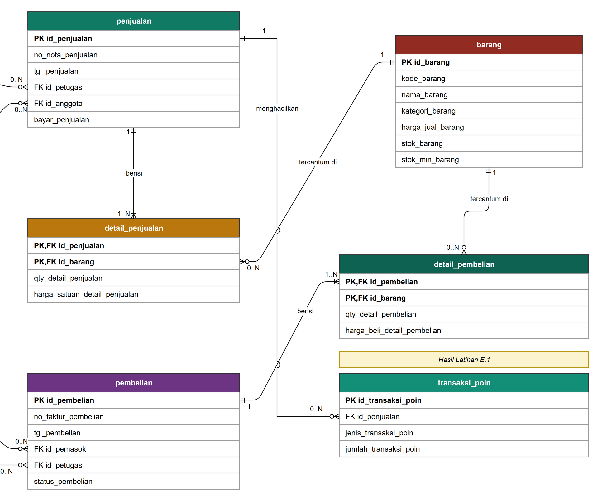
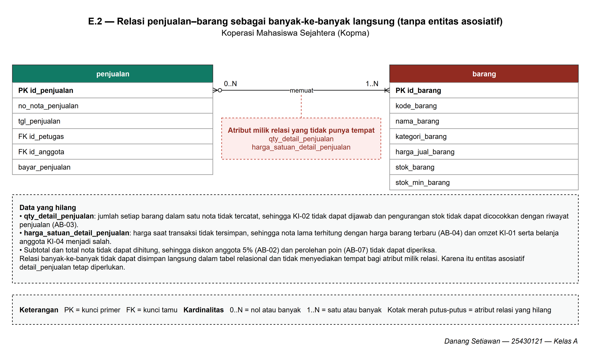

# Laporan Praktikum Basis Data - Pertemuan 03

- **Nama:** Danang Setiawan
- **NIM:** 25430121
- **Kelas:** A
- **Tanggal:** 09 Oktober 2026
- **Dosen:** Dedi Irawan, S.Kom., M.T.I.

## 1. Tujuan Praktikum

## 2. Ringkasan Dasar Teori

## 3. Hasil Langkah Percobaan

### D.1 Dari entitas kandidat ke entitas
### D.2 Menentukan relasi dan kardinalitas

Untuk setiap pasangan entitas yang berhubungan, saya menulis kalimat relasi dengan kata kerja, lalu menjawab "minimal berapa?" dan "maksimal berapa?" dari kedua arah. Setiap kardinalitas ditelusuri ke aturan bisnis yang mendasarinya.

| Relasi | Sisi kiri | Sisi kanan | Dasar |
|---|---|---|---|
| petugas melayani penjualan | tepat satu petugas | nol atau banyak penjualan | wawancara kasir |
| anggota melakukan penjualan | nol atau satu anggota | nol atau banyak penjualan | AB-02 |
| penjualan berisi detail_penjualan | tepat satu penjualan | satu atau banyak detail | AB-01 |
| barang tercantum di detail_penjualan | tepat satu barang | nol atau banyak detail | AB-04 |
| pemasok menerima pembelian | tepat satu pemasok | nol atau banyak pembelian | AB-06 |
| pembelian berisi detail_pembelian | tepat satu pembelian | satu atau banyak detail | faktur pemasok |
| barang tercantum di detail_pembelian | tepat satu barang | nol atau banyak detail | faktur pemasok |
| petugas menangani pembelian | tepat satu petugas | nol atau banyak pembelian | AB-12 |

**Catatan tambahan di luar Tabel 3.2 buku:**

Dua baris terakhir tidak tercantum pada Tabel 3.2 buku. Relasi `barang tercantum di detail_pembelian` saya tambahkan karena relasi tersebut tampak pada Gambar 3.2 dan diperlukan agar entitas `detail_pembelian` memiliki rujukan ke barang yang dibeli. Relasi `petugas menangani pembelian` merupakan hasil Titik Analisis 3 dan didasarkan pada AB-12 yang saya tambahkan.

### D.3 Menggambar ERD
### D.4 Memvalidasi ERD terhadap kebutuhan informasi

Saya menelusuri jalur hubungan pada ERD untuk memastikan setiap kebutuhan informasi dapat dijawab oleh entitas yang tersedia. Pemeriksaan awal menunjukkan bahwa KI-05 dan KI-06 belum dapat ditelusuri karena ERD belum memiliki entitas riwayat poin. Setelah mengerjakan Latihan E.1, saya menambahkan transaksi_poin beserta relasinya, lalu memperbarui jalur kedua kebutuhan informasi tersebut.

| Kode | Kebutuhan informasi | Jalur di ERD |
|---|---|---|
| KI-01 | Omzet dan jumlah nota per hari dan per bulan | penjualan → detail_penjualan |
| KI-02 | Lima barang terlaris per bulan berdasarkan qty | barang → detail_penjualan → penjualan |
| KI-03 | Barang dengan stok di bawah batas minimum | barang |
| KI-04 | Sepuluh anggota dengan belanja terbesar per bulan | anggota → penjualan → detail_penjualan |
| KI-05 | Jumlah poin yang diperoleh dan ditukar anggota per bulan | anggota → penjualan → transaksi_poin |
| KI-06 | Sepuluh anggota dengan perolehan poin terbanyak per bulan | anggota → penjualan → transaksi_poin |

## 4. Jawaban Titik Analisis

### Titik Analisis 1 — Kunci primer dan kunci alternatif

Saya memilih `id_anggota` sebagai kunci primer karena merupakan identitas internal yang tetap dan tidak bergantung pada data bisnis anggota. `no_anggota` dan `nim_anggota` tetap disimpan sebagai kunci alternatif dengan constraint `UNIQUE`, sehingga pencarian anggota melalui nomor anggota atau NIM tetap dapat dilakukan tanpa menjadikan data tersebut sebagai kunci primer.

Jika NIM dijadikan kunci primer, salah satu risikonya adalah ketika NIM berubah, perubahan tersebut dapat merambat ke kunci tamu pada tabel lain yang mengacu ke anggota sehingga berisiko menimbulkan inkonsistensi data.

### Titik Analisis 2 — Kardinalitas minimal satu detail

**Bagian A**

Relasi `Penjualan` terhadap `Detail penjualan` pada kasus Kopma bernilai `1..N` karena **AB-01** menyatakan bahwa setiap nota memiliki nomor unik dan minimal satu baris barang. Artinya, sebuah nota tanpa barang tidak dianggap sebagai transaksi penjualan yang lengkap. AB-02 hanya mengatur batas lain, yaitu penjualan untuk anggota aktif dan diskon 5%, sehingga tidak menjadi dasar untuk nilai minimum detail.

**Bagian B**

Aturan minimal satu detail tidak dapat dijaga hanya dengan struktur tabel. Foreign key pada `Detail penjualan` hanya memastikan bahwa detail mengacu pada `Penjualan` yang valid, tetapi tidak memaksa setiap `Penjualan` memiliki minimal satu detail. Pelanggaran dapat terjadi ketika data `Penjualan` sudah dibuat tetapi baris `Detail penjualan` belum sempat dibuat, lalu proses berhenti. Karena itu, aturan minimal satu detail perlu dijaga melalui transaksi atau logika aplikasi.

### Titik Analisis 3 — Petugas yang menerima barang dari pemasok

ERD awal belum dapat menunjukkan petugas gudang yang menerima barang dari pemasok karena `Pembelian` baru memiliki hubungan dengan `Pemasok`. Belum ada hubungan yang mencatat petugas yang menangani penerimaan tersebut.

Saya menambahkan relasi **petugas menangani pembelian** dengan kardinalitas **tepat satu petugas** untuk setiap `Pembelian` dan **nol atau banyak pembelian** untuk setiap `Petugas`. Dengan relasi ini, setiap transaksi penerimaan dapat ditelusuri kepada petugas yang menanganinya.

Keputusan tersebut perlu dicatat sebagai aturan bisnis baru karena informasi petugas yang menangani penerimaan merupakan kebutuhan bisnis, bukan hanya kebutuhan teknis ERD. Aturannya adalah **AB-12: Setiap penerimaan barang dari pemasok harus mencatat petugas gudang yang menerima barang.**

## 5. Hasil Latihan dan Modifikasi

### E.1 Poin loyalitas pada ERD

Saya memilih membuat entitas riwayat **transaksi_poin**, bukan menyimpan saldo poin sebagai atribut pada anggota. Keputusan ini diambil karena KI-05 membutuhkan jumlah poin yang diperoleh dan ditukar anggota per bulan, sedangkan KI-06 membutuhkan daftar anggota dengan perolehan poin terbanyak per bulan. Jika hanya saldo terakhir yang disimpan pada anggota, riwayat perolehan dan penukaran pada bulan sebelumnya tidak dapat ditelusuri dengan tepat.

| Pertimbangan | Atribut poin pada anggota | Entitas riwayat transaksi_poin |
|---|---|---|
| KI-05: poin diperoleh dan ditukar per bulan | Tidak dapat dijawab karena hanya saldo terakhir yang tersimpan | Dapat dijawab dari jenis dan jumlah setiap transaksi poin |
| KI-06: anggota dengan perolehan poin terbanyak per bulan | Tidak dapat dijawab karena perolehan bulan lalu tertimpa saldo baru | Dapat dijawab dengan menjumlahkan perolehan per anggota per bulan |
| AB-10: setiap penukaran dicatat sebagai transaksi | Tidak terpenuhi karena penukaran hanya mengurangi angka saldo | Terpenuhi karena setiap penukaran 50 poin menjadi satu baris |

Saldo poin anggota merupakan atribut turunan karena nilainya dapat dihitung dari jumlah perolehan dikurangi jumlah penukaran. Karena itu saldo tidak digambar sebagai atribut anggota, sesuai keputusan pada dokumen kebutuhan data Modul 2. Pemeriksaan saldo minimal 50 poin pada AB-09 dilakukan dengan menghitung saldo tersebut dari riwayat.

Entitas transaksi_poin memiliki atribut id_transaksi_poin sebagai kunci primer, id_penjualan sebagai kunci tamu, serta jenis_transaksi_poin dan jumlah_transaksi_poin untuk mencatat apakah poin diperoleh atau ditukar dan berapa jumlahnya. Jumlah poin tetap disimpan meskipun perolehan dapat dihitung dari total belanja, karena aturan poin dapat berubah dan riwayat lama tidak boleh ikut berubah, sama seperti alasan AB-04.

**Penyempurnaan dari kamus data Modul 2.** Kamus data awal masih mencantumkan id_anggota dan tanggal_transaksi_poin pada transaksi poin. Kedua atribut tersebut tidak saya masukkan ke ERD karena setiap perolehan dan penukaran poin terjadi pada satu nota (AB-07 dan PB-08), sedangkan nota sudah menyimpan anggota pada id_anggota dan tanggal pada tgl_penjualan. Jika keduanya disimpan lagi, ERD memiliki dua jalur menuju anggota, yaitu anggota → penjualan → transaksi_poin dan anggota → transaksi_poin, yang dapat saling bertentangan, misalnya poin tercatat milik anggota yang berbeda dari pemilik nota.

Relasi yang saya tambahkan pada ERD:

| Relasi | Sisi kiri | Sisi kanan | Dasar |
|---|---|---|---|
| penjualan menghasilkan transaksi_poin | tepat satu penjualan | nol atau banyak transaksi_poin | AB-07, AB-10, PB-08 |

Sisi penjualan bernilai tepat satu karena perolehan poin dihitung dari total belanja satu nota (AB-07), sedangkan penukaran poin dilakukan saat pembayaran nota (PB-08). Sisi transaksi_poin bernilai nol atau banyak karena nota pembeli umum atau nota yang tidak memenuhi syarat poin tidak menghasilkan transaksi poin (AB-02, AB-07). Sebaliknya, satu nota dapat mencatat perolehan sekaligus beberapa penukaran, karena setiap penukaran 50 poin dicatat sebagai satu transaksi (AB-10). Aturan bahwa transaksi poin hanya boleh dicatat pada nota milik anggota aktif (AB-07, AB-09) tidak dapat dijaga oleh struktur tabel saja, sehingga perlu dijaga dengan transaksi, seperti jawaban Titik Analisis 2.

Perubahan ini ditandai pada ERD dengan label **Hasil Latihan E.1**. KI-05 dan KI-06 sekarang dapat ditelusuri melalui jalur anggota → penjualan → transaksi_poin: anggota diambil dari id_anggota pada penjualan, bulan dari tgl_penjualan, sedangkan jenis dan jumlah poin dari transaksi_poin.

*Gambar E.1 Entitas transaksi_poin dan relasi penjualan menghasilkan transaksi_poin pada ERD Kopma.*

### E.2 Relasi banyak-ke-banyak langsung

Saya mencoba menghubungkan Penjualan dan Barang secara langsung dengan relasi banyak-ke-banyak tanpa entitas asosiatif Detail penjualan. Gambarnya ada pada halaman **E2-banyak-ke-banyak** di berkas p03_erd_kopma_25430121.drawio. Satu penjualan memuat satu atau banyak barang (AB-01), sedangkan satu barang dapat dimuat di nol atau banyak penjualan. Kardinalitas ini sama dengan gabungan relasi penjualan berisi detail_penjualan (1..N) dan barang tercantum di detail_penjualan (0..N) pada ERD utama.

*Gambar E.2 Relasi penjualan–barang tanpa entitas asosiatif detail_penjualan.*

Dari percobaan ini, saya menemukan bahwa informasi yang melekat pada setiap pasangan penjualan dan barang tidak dapat dicatat. Relasi banyak-ke-banyak tidak dapat disimpan langsung dalam tabel relasional dan tidak menyediakan tempat bagi atribut milik relasi, sehingga ada dua elemen data penting yang hilang:

1. **qty_detail_penjualan** — Tanpa elemen ini, sistem tidak dapat mencatat jumlah barang yang dibeli pada setiap transaksi. Akibatnya, KI-02, yaitu lima barang terlaris per bulan berdasarkan kuantitas, tidak dapat dijawab. Pengurangan stok juga tidak dapat dicocokkan dengan riwayat penjualan, sehingga AB-03 tidak dapat diperiksa.

2. **harga_satuan_detail_penjualan** — Tanpa elemen ini, sistem tidak dapat menyimpan harga satuan yang berlaku ketika transaksi terjadi, sehingga AB-04 tidak terpenuhi. Jika harga barang berubah, nilai transaksi lama ikut dihitung dengan harga terbaru. Akibatnya, omzet pada KI-01 dan jumlah belanja anggota pada KI-04 tidak dapat dihitung dengan benar.

Karena qty dan harga satuan hilang, subtotal dan total nota sebagai atribut turunan juga tidak dapat dihitung. Akibatnya, diskon anggota 5% (AB-02) dan perolehan poin dari total belanja (AB-07) tidak dapat diperiksa.

KI-01 masih dapat menggunakan data Penjualan untuk menghitung jumlah nota per hari atau per bulan, tetapi bagian omzetnya tidak dapat dihitung tanpa data detail transaksi.

KI-03, yaitu daftar barang dengan stok di bawah batas minimum, masih dapat dijalankan karena stok_barang dan stok_min_barang tetap tersedia pada entitas Barang. Namun, kebenaran stok tersebut tidak dapat diperiksa ulang dari riwayat penjualan karena qty setiap nota tidak tercatat.

Riwayat poin untuk KI-05 dan KI-06 tetap tersimpan pada transaksi_poin. Namun, jumlah poin perolehan tidak dapat diverifikasi karena AB-07 menghitung poin dari total belanja, sedangkan total belanja tidak dapat dihitung tanpa qty dan harga satuan.

Berdasarkan percobaan ini, saya menyimpulkan bahwa Detail penjualan tetap diperlukan sebagai entitas asosiatif untuk menyimpan qty_detail_penjualan dan harga_satuan_detail_penjualan pada setiap pasangan penjualan dan barang.

## 6. Tugas Mandiri: Milestone Proyek 3

## 7. Pembahasan dan Kendala

## 8. Kesimpulan

## 9. Pernyataan Penggunaan AI

## 10. Bukti Git

## Checklist